# FaceTrace — Face Search + Blockchain Verification

> **SocialDetective** CLI application: an end-to-end pipeline that detects faces,
> searches the web for matching images, fingerprints discovered content, records
> it on the Ethereum blockchain, and verifies integrity.

```
Face image → Face detection → Face encoding → Web search →
Candidate matching → Content retrieval → SHA-256 fingerprint →
Blockchain record → Verification
```

---

## Architecture

```mermaid
flowchart TD
    %% ─────────────────────────────────────────────────────────────
    %% STYLING DEFINITIONS
    %% ─────────────────────────────────────────────────────────────
    classDef default fill:#1f2937,stroke:#475569,color:#f8fafc,stroke-width:1.5px
    classDef inputNode fill:#0f172a,stroke:#38bdf8,color:#f8fafc,stroke-width:2px
    classDef aiNode fill:#1e1b4b,stroke:#818cf8,color:#e0e7ff,stroke-width:2px
    classDef searchNode fill:#064e3b,stroke:#34d399,color:#ecfdf5,stroke-width:2px
    classDef matchNode fill:#3b0764,stroke:#a855f7,color:#faf5ff,stroke-width:2px
    classDef cryptoNode fill:#701a75,stroke:#f472b6,color:#fdf2f8,stroke-width:2px
    classDef chainNode fill:#431407,stroke:#fb923c,color:#fff7ed,stroke-width:2px
    classDef verifyNode fill:#082f49,stroke:#38bdf8,color:#f0f9ff,stroke-width:2px
    classDef verifiedNode fill:#14532d,stroke:#22c55e,color:#f0fdf4,stroke-width:2.5px
    classDef tamperedNode fill:#7f1d1d,stroke:#ef4444,color:#fef2f2,stroke-width:2.5px

    %% ─────────────────────────────────────────────────────────────
    %% PHASE 1: BIOMETRIC INGESTION & FEATURE EXTRACTION
    %% ─────────────────────────────────────────────────────────────
    subgraph P1 ["Phase 1: Biometric Intake & Face Feature Extraction"]
        IN(["Query Face Image<br/>e.g. test_face.jpg"]):::inputNode
        CLI["CLI Options & Parameters<br/>--threshold, --platform, --target, --engine, --handle"]:::inputNode
        DET["InsightFace Detector<br/>buffalo_l Model (5-point Landmark Alignment)"]:::aiNode
        EMB["ArcFace Embedding Engine<br/>512-Dimensional Normalized Vector"]:::aiNode
        CROP["Portrait Face Cropper<br/>Tight Bounding Box + 35% Margin (Fallback)"]:::aiNode

        IN --> DET
        CLI -.->|"Configure thresholds & paths"| DET
        DET --> EMB
        DET --> CROP
    end

    %% ─────────────────────────────────────────────────────────────
    %% PHASE 2: SEARCH CASCADE & OSINT DISCOVERY
    %% ─────────────────────────────────────────────────────────────
    subgraph P2 ["Phase 2: Multi-Engine Search Cascade & OSINT Discovery"]
        ROUTER{"Execution Mode<br/>Targeted vs Cascade"}:::searchNode

        T_URL["Target URL Extractor<br/>Instagram Carousels, X/Twitter, Reddit, Web"]:::searchNode
        T_USER["Twitter Timeline Provider<br/>Direct Profile Media Tweet Extraction"]:::searchNode

        LENS["Primary: Google Lens Visual Search<br/>SerpAPI Reverse Image Discovery"]:::searchNode
        LENS_CROP["Fallback 1: Cropped Face Search<br/>Focused Facial Geometry Query"]:::searchNode
        YANDEX["Fallback 2: Yandex Images<br/>Deep Biometric Facial Search"]:::searchNode
        PIVOT["OSINT Identity & Network Pivoting<br/>Social Handles & Associate Graph Sweep"]:::searchNode

        MEDIA_POOL[("Candidate Media Pool<br/>Post URLs, Image URLs, Platform Metadata")]:::searchNode

        EMB --> ROUTER
        ROUTER -->|"--target URL"| T_URL
        ROUTER -->|"--handle user"| T_USER
        ROUTER -->|"Default: --engine all"| LENS

        LENS -->|"No match above threshold"| LENS_CROP
        LENS_CROP -->|"Still below threshold"| YANDEX
        LENS -.->|"Discovered Handles"| PIVOT
        YANDEX -.->|"Associate Leads"| PIVOT

        T_URL --> MEDIA_POOL
        T_USER --> MEDIA_POOL
        LENS --> MEDIA_POOL
        LENS_CROP --> MEDIA_POOL
        YANDEX --> MEDIA_POOL
        PIVOT --> MEDIA_POOL
    end

    %% ─────────────────────────────────────────────────────────────
    %% PHASE 3: CANDIDATE MATCHING & RANKING
    %% ─────────────────────────────────────────────────────────────
    subgraph P3 ["Phase 3: Biometric Verification & Candidate Ranking"]
        CAND_EMB["Candidate Face Processor<br/>Extract 512-d ArcFace Vector per Candidate"]:::aiNode
        MATCHER["FaceMatcher Engine<br/>Cosine Similarity = dot(q, c) / (||q|| * ||c||)"]:::matchNode
        FILTER["Ranking & Threshold Filter<br/>Platform Filtering & Score Meets Threshold"]:::matchNode
        WINNER(["Rank #1 Strongest Match Selected<br/>Highest Facial Similarity Score"]):::matchNode

        MEDIA_POOL --> CAND_EMB
        EMB -.->|"Query Vector (512-d)"| MATCHER
        CAND_EMB --> MATCHER
        MATCHER --> FILTER
        FILTER --> WINNER
    end

    %% ─────────────────────────────────────────────────────────────
    %% PHASE 4: FORENSIC ACQUISITION & CANONICALIZATION
    %% ─────────────────────────────────────────────────────────────
    subgraph P4 ["Phase 4: Forensic Content Acquisition & Canonical Packaging"]
        ACQUIRE["Content Retriever<br/>Fetch Post HTML, Text, Author, Timestamp"]:::cryptoNode
        IMG_DOWNLOAD["Media Ingestion<br/>Download Raw Image Bytes"]:::cryptoNode
        IMG_HASH["Image Cryptographic Hash<br/>Compute SHA-256 of Raw Image Bytes"]:::cryptoNode
        CANON["Forensic Canonicalizer<br/>Deterministic Sorted JSON Key-Value Map"]:::cryptoNode

        WINNER --> ACQUIRE
        WINNER --> IMG_DOWNLOAD
        IMG_DOWNLOAD --> IMG_HASH
        ACQUIRE --> CANON
        IMG_HASH --> CANON
    end

    %% ─────────────────────────────────────────────────────────────
    %% PHASE 5: CRYPTOGRAPHIC SEAL & BLOCKCHAIN NOTARIZATION
    %% ─────────────────────────────────────────────────────────────
    subgraph P5 ["Phase 5: Cryptographic Sealing & Blockchain Notarization"]
        SHA["SHA-256 Fingerprint Generator<br/>Produces Unique 32-Byte Content Hash"]:::cryptoNode
        WEB3["Web3.py Client<br/>Sign & Submit Transaction to Ethereum Sepolia"]:::chainNode
        CONTRACT[("ContentRegistry.sol Smart Contract<br/>Address: 0xe25BfF359d31b3E2B3fF99692E6cE025f273BC21<br/>Ethereum Sepolia Testnet")]:::chainNode
        DOSSIER[("Local Forensic Dossier<br/>Saved to data/results/*_record.json")]:::chainNode

        CANON --> SHA
        SHA -->|"bytes32 contentHash"| WEB3
        WEB3 -->|"registerContent(hash, sourceId)"| CONTRACT
        CONTRACT -.->|"Tx Hash & Block Confirmation"| DOSSIER
    end

    %% ─────────────────────────────────────────────────────────────
    %% PHASE 6: INDEPENDENT VERIFICATION & TAMPER DETECTION
    %% ─────────────────────────────────────────────────────────────
    subgraph P6 ["Phase 6: Independent Verification & Tamper Detection"]
        V_CLI["facetrace verify --record record.json<br/>CLI Verification Tool"]:::verifyNode
        V_LOCAL["Recompute Canonical SHA-256 Hash<br/>From Local Record Fields"]:::verifyNode
        V_QUERY["Query Smart Contract<br/>Check ContentRegistry.records(hash)"]:::verifyNode
        V_CHECK{"Integrity Check:<br/>Local Hash == On-Chain Hash?"}:::verifyNode

        V_PASS(["✓ CONTENT VERIFIED<br/>Proof Intact: 100% Authentic & Untampered"]):::verifiedNode
        V_FAIL(["✗ TAMPER DETECTED<br/>Hash Mismatch: Text, Image, or Meta Altered"]):::tamperedNode

        DOSSIER -.->|"Audit Target"| V_CLI
        V_CLI --> V_LOCAL
        V_CLI --> V_QUERY
        V_LOCAL --> V_CHECK
        V_QUERY --> V_CHECK
        V_CHECK -->|"Identical Hash Found On-Chain"| V_PASS
        V_CHECK -->|"Hash Differs or Not Registered"| V_FAIL
    end
```



### Pipeline Overview

| Phase | Stage | Engine / Technology | Description |
|---|---|---|---|
| **1** | **Biometric Intake** | InsightFace & ArcFace (`buffalo_l`) | Detects face landmarks, generates 512-d normalized embedding vector & tight portrait crops. |
| **2** | **Search Cascade & OSINT** | Google Lens, Yandex & Scrapers | Multi-engine cascade (Lens → Crop → Yandex) plus targeted scraping (`--target`, `--handle`) & associate pivoting. |
| **3** | **Biometric Verification** | Cosine Similarity Ranking | Computes cosine similarity between query and candidate face vectors; filters and ranks matches. |
| **4** | **Forensic Acquisition** | ContentRetriever & SHA-256 | Extracts public post metadata, downloads raw image bytes, and formats deterministic canonical JSON. |
| **5** | **Blockchain Notarization** | Web3.py & Solidity 0.8.19 | Submits immutable 32-byte content hash to `ContentRegistry.sol` on Ethereum Sepolia testnet. |
| **6** | **Integrity Verification** | Local Re-Hash vs Sepolia Contract | Recalculates local hash and queries on-chain state to confirm data authenticity or detect tampering. |

---

## Features

- **Face Detection & Encoding** — InsightFace with ArcFace (`buffalo_l` model, 512-d embeddings)
- **Multi-Engine Visual Search** — SerpAPI Google Lens + Yandex Images reverse search cascade
- **Deep Social Discovery** — Instaloader integration for Instagram carousels (`GraphSidecar`), author metadata, and captions
- **Targeted Post Inspection (`--target`)** — Dynamically parses candidate media from Twitter/X, Instagram, LinkedIn, and web posts
- **Face Similarity Matching** — ArcFace cosine similarity ranking with configurable threshold
- **Content Fingerprinting** — SHA-256 hash of canonical content + raw image bytes
- **Blockchain Recording** — Ethereum Sepolia smart contract for tamper-evident storage
- **Integrity Verification** — Compare local content hash against on-chain record
- **Tamper Detection** — Modify any field or image byte and verification catches it

---

## How It Works (In Plain English)

> *"Think of FaceTrace as an automated digital detective and public notary."*
>
> You provide a face image $\rightarrow$ it scours the internet for matching social media posts $\rightarrow$ then locks proof of what it discovered onto the Ethereum blockchain so **no one can ever edit, fake, or tamper with the evidence.**

### The 7 Steps Explained

1. **Face Scan (*Turning a face into math*)**:
   Instead of storing raw images, AI analyzes the unique facial geometry (eye spacing, jawline, nose contours) and converts it into a 512-number coordinate ("embedding"). This allows the system to recognize the person even with different lighting, angles, or hairstyles.

   <p align="center">
     
   </p>

2. **Open Web Search (*The detective search*)**:
   The query photo is searched across Google Lens and Yandex Images via SerpAPI to conduct a **live, runtime reverse-image search** across dozens of platforms including **Reddit, Instagram, X/Twitter, Facebook, and Wikipedia**.

3. **Digital Lineup (*Face similarity ranking*)**:
   The application downloads candidate images found online and runs facial recognition on each one, computing a mathematical similarity score (e.g., *97.4% match*). The candidate with the strongest face similarity is selected.

4. **Evidence Collection (*Capturing the post*)**:
   Public metadata from the winning post is extracted: source URL, page title, author handle, text/captions, domain, and the raw image bytes.

5. **Digital Wax Seal (*SHA-256 fingerprinting*)**:
   The post metadata and raw image bytes are packaged into a deterministic canonical structure and hashed using SHA-256. If even a single word in the post or a single pixel in the image is changed later, this fingerprint changes completely.

6. **Notarizing on the Blockchain (*Permanent public record*)**:
   The 32-byte content hash is registered onto the **Ethereum Sepolia** testnet via a smart contract (`ContentRegistry.sol`).
   > **Privacy Note:** No private information, face images, or biometric face vectors are ever uploaded on-chain. Only the cryptographic content fingerprint is stored.

7. **Verification & Tamper Detection (*Catching modifications*)**:
   Anyone can re-verify the saved investigation file at any point in the future:
   - **If unaltered**: Local hash matches the on-chain hash $\rightarrow$ `✓ CONTENT VERIFIED`
   - **If modified**: Any altered text or replaced image changes the local hash $\rightarrow$ `✗ TAMPER DETECTED`

---

## Tech Stack

| Component | Technology |
|-----------|-----------|
| Face Detection | InsightFace / ArcFace (buffalo_l) |
| Face Embeddings | 512-d ArcFace via ONNX Runtime |
| Web Search Engines | SerpAPI Google Lens & Yandex Images |
| Social Scrapers | Instaloader (Instagram) & BeautifulSoup4 |
| Content Hashing | SHA-256 (hashlib) |
| Blockchain | Ethereum Sepolia + Solidity 0.8.19 |
| Smart Contract | Web3.py + py-solc-x |
| CLI | Python argparse + colorama |

---

## Installation

```bash
# Clone
git clone <repo-url>
cd social-detective

# Install dependencies
pip install -r requirements.txt

# Copy environment template
cp .env.example .env
# Edit .env with your credentials (see below)
```

### InsightFace Models

On first run, InsightFace automatically downloads the `buffalo_l` model pack (~300MB) to `~/.insightface/models/`. No manual setup needed.

---

## Environment Variables

Create a `.env` file from the template:

```bash
cp .env.example .env
```

| Variable | Required | Description |
|----------|----------|-------------|
| `SERPAPI_KEY` | ✓ | API key from [serpapi.com](https://serpapi.com/manage-api-key) |
| `RPC_URL` | ✓ | Ethereum Sepolia RPC endpoint (Infura/Alchemy) |
| `PRIVATE_KEY` | ✓ | Wallet private key (NEVER share or commit) |
| `CONTRACT_ADDRESS` | ✓ | Deployed ContentRegistry address |

### SerpAPI Setup

1. Sign up at [serpapi.com](https://serpapi.com)
2. Get your API key from [Manage API Key](https://serpapi.com/manage-api-key)
3. Add to `.env`: `SERPAPI_KEY=your_key_here`

### Blockchain Setup

1. Create a wallet (e.g., MetaMask) and export the private key
2. Get an RPC endpoint:
   - [Infura](https://infura.io) — create a project, copy Sepolia endpoint
   - [Alchemy](https://alchemy.com) — create an app, copy Sepolia endpoint
3. Get free Sepolia ETH:
   - [Google Cloud Faucet](https://cloud.google.com/application/web3/faucet/ethereum/sepolia)
   - [Alchemy Faucet](https://sepoliafaucet.com)
4. Deploy the contract (see below)

---

## Smart Contract Deployment

The `ContentRegistry` contract is already deployed on **Ethereum Sepolia**:

- **Contract Address:** [`0xe25BfF359d31b3E2B3fF99692E6cE025f273BC21`](https://sepolia.etherscan.io/address/0xe25BfF359d31b3E2B3fF99692E6cE025f273BC21)
- **Deployment Transaction:** [`0xc96cff185e7d482fc64a76a2fa2a4a907fa0dcd2bc0b760d76447d9789c90eb5`](https://sepolia.etherscan.io/tx/0xc96cff185e7d482fc64a76a2fa2a4a907fa0dcd2bc0b760d76447d9789c90eb5)

If you wish to redeploy your own instance:

```bash
python scripts/deploy_contract.py
```

---

## How to Run

### Full Pipeline (Searches Open Web & Picks Strongest Match)

```bash
python -m app.main --image ./data/input/test_face.jpg
```

### Visual Search Engine Selection (`--engine`)

Choose between Google Lens, Yandex Images, or the automatic multi-engine cascade:

```bash
# Multi-engine cascade (default): Google Lens -> Portrait Crop -> Yandex Images
python -m app.main --image ./data/input/test_face.jpg --engine all

# Force Google Lens only
python -m app.main --image ./data/input/test_face.jpg --engine lens

# Force Yandex Images only (deep biometric facial/social search)
python -m app.main --image ./data/input/test_face.jpg --engine yandex
```

### Target a Specific Platform (Optional)

You can filter candidate results to a specific social/web platform:

```bash
# Target Wikipedia
python -m app.main --image ./data/input/test_face.jpg --platform wikipedia

# Target Instagram
python -m app.main --image ./data/input/test_face.jpg --platform instagram

# Target X / Twitter
python -m app.main --image ./data/input/test_face.jpg --platform x.com
```

### Targeted Social Post / URL Verification (`--target`)

When investigating a suspected appearance on a specific social media post, reel, or webpage, use `--target` to dynamically extract media from that URL and verify biometric identity without hardcoding:

```bash
# Verify against an Instagram Carousel Post (extracts all slides dynamically)
python -m app.main --image ./data/input/test_face_7.jpg --target https://www.instagram.com/p/DNQM2qFvvTv/?img_index=1

# Verify against an X/Twitter post
python -m app.main --image ./data/input/test_face_4.png --target https://x.com/supreme__sahil/status/2087906598962524208

# Verify against another X/Twitter post
python -m app.main --image ./data/input/test_face_3.jpg --target https://x.com/Aryannn_6476476/status/2086348435729575971
```

With custom threshold (default: 0.70):
```bash
python -m app.main --image ./data/input/test_face.jpg --threshold 0.85
```

### Example Terminal Output

```
============================================================
               FACETRACE
      Face Search + Blockchain Verification
============================================================

  [1/7] FACE DETECTION
        ✓ Face detected
        ✓ Face embedding generated (512-d)

  [2/7] WEB SEARCH
        Provider: SerpAPI Google Lens
        Searching...
        ✓ Search completed
        ✓ 59 candidates discovered across the web
        Sources found: AMDB, Amazon.com, BBC, Bollywood Hungama, Britannica (+35 more)

  [3/7] FACE MATCHING
        Analyzing candidate face similarity...

        #1   Similarity: 96.8%  [Reddit]
        #2   Similarity: 96.8%  [Instagram]
        #3   Similarity: 96.6%  [Wikipedia]
        #4   Similarity: 96.4%  [x.com]
        #5   Similarity: 96.3%  [Wikimedia Commons]
        #6   Similarity: 96.2%  [Bear 5 Wiki | Fandom]
        #7   Similarity: 88.5%  [Wikipedia]
        #8   Similarity: 87.2%  [Wikimedia Commons]
        #9   Similarity: 84.9%  [YouTube]
        #10  Similarity: 83.6%  [The Daily Beast]

        ✓ Strongest candidate selected: Reddit (Similarity: 96.8%)

  [4/7] CONTENT RETRIEVAL
        ✓ Matching content retrieved

        Source:
        https://www.reddit.com/r/theydidthemath/comments/...
        Title: Reddit
        Platform: www.reddit.com

        ✓ Image downloaded (7729 bytes)

  [5/7] FINGERPRINT
        Algorithm: SHA-256

        3dfa3770bf9bf062217952d2b2f8526a08192a5a886a64ffa63b068911e2bfeb

  [6/7] BLOCKCHAIN
        Network: Ethereum Sepolia
        Contract: 0xe25BfF359d31b3E2B3fF99692E6cE025f273BC21
        Submitting transaction...
        ✓ Transaction confirmed

        TX:
        0x9753a6661c6bc3d1be336529621e2faa704304f071715c885e25f82ae91a0c06
        Block: 11619452

  [7/7] VERIFICATION
        Local hash:
        3dfa3770bf9bf062217952d2b2f8526a08192a5a886a64ffa63b068911e2bfeb

        On-chain: ✓ Hash found

        ✓ CONTENT VERIFIED

  Record saved:
  data/results/20260902_120214_record.json

============================================================
```

---

## How to Verify a Record

```bash
python -m app.main verify --record ./data/results/20260902_100000_record.json
```

Or directly:
```bash
python -m app.verify --record ./data/results/20260902_100000_record.json
```

---

## How to Demonstrate Tampering

1. **Run the pipeline** and save a record:
   ```bash
   python -m app.main --image ./data/input/face.jpg
   ```

2. **Verify it** (should show ✓ VERIFIED):
   ```bash
   python -m app.main verify --record ./data/results/<timestamp>_record.json
   ```

3. **Tamper with the record** — open the JSON file and change any field in the
   `content` section. For example, change `"text"` or `"image_hash"`:
   ```json
   {
     "content": {
       "text": "TAMPERED content here"
     }
   }
   ```

4. **Verify again** (should show ✗ TAMPER DETECTED):
   ```bash
   python -m app.main verify --record ./data/results/<timestamp>_record.json
   ```

   Output:
   ```
   ============================================================
              VERIFICATION
   ============================================================

     Local hash (current):
     abc123...

     Original hash (registered):
     xyz789...

     On-chain:  ✓ Hash found

     ✗ TAMPER DETECTED
     TAMPER DETECTED — content has been modified since registration

   ============================================================
   ```

---

## Saved Record Format

Each investigation is saved as `data/results/<timestamp>_record.json`:

```json
{
  "query": {
    "image": "/path/to/face.jpg",
    "face_detected": true,
    "embedding_dim": 512
  },
  "search": {
    "provider": "SerpAPI Google Lens",
    "searched_at": "2026-09-02T10:00:00+00:00",
    "candidate_count": 18
  },
  "match": {
    "source_url": "https://...",
    "image_url": "https://...",
    "similarity": 0.914,
    "domain": "instagram.com",
    "title": "..."
  },
  "content": {
    "source_url": "https://...",
    "image_url": "https://...",
    "platform": "www.instagram.com",
    "title": "...",
    "text": "...",
    "image_hash": "a1b2c3...",
    "retrieved_at": "2026-09-02T10:00:01+00:00"
  },
  "fingerprint": {
    "algorithm": "SHA-256",
    "hash": "8f91c2f3..."
  },
  "blockchain": {
    "network": "Ethereum Sepolia",
    "contract": "0x...",
    "transaction": "0x...",
    "block": 123456,
    "status": "confirmed"
  },
  "verification": {
    "verified": true
  }
}
```

---

## Testing

```bash
# Run all unit tests (no credentials needed)
python -m pytest tests/ -v
```

Tests cover:
- Face detection (invalid images, no face, embedding extraction)
- Search providers (mock provider, API key validation)
- Cosine similarity (identical, orthogonal, random vectors)
- SHA-256 hashing (determinism, known values)
- Canonicalization (sorted keys, image hash inclusion, round-trip)
- Tamper detection (modified content → different hash)
- Blockchain data formatting (bytes32 conversion, ABI loading)

---

## Project Structure

```
social-detective/
├── app/
│   ├── __init__.py        # Package init
│   ├── main.py            # CLI entry point + pipeline orchestration
│   ├── config.py          # Environment variables + settings
│   ├── face.py            # Face detection + ArcFace embeddings
│   ├── search.py          # Search provider (SerpAPI Google Lens)
│   ├── matcher.py         # Face similarity matching
│   ├── content.py         # Content retrieval + canonicalization
│   ├── hashing.py         # SHA-256 fingerprinting
│   ├── blockchain.py      # Web3.py + Solidity interaction
│   └── verify.py          # Verification logic
├── contracts/
│   └── ContentRegistry.sol
├── scripts/
│   └── deploy_contract.py
├── data/
│   ├── input/             # Place query images here
│   └── results/           # Saved investigation records
├── tests/
│   ├── test_face.py
│   ├── test_search.py
│   ├── test_matching.py
│   ├── test_hashing.py
│   └── test_blockchain.py
├── .env.example
├── .gitignore
├── requirements.txt
├── pyproject.toml
└── README.md
```

---

## Known Limitations

- **SerpAPI quota**: Free tier has limited searches per month
- **Google Lens results**: Not all images produce face-containing results
- **Candidate images**: Some thumbnails may be too small for reliable face detection
- **Blockchain costs**: Transactions require Sepolia test ETH (free from faucets)
- **Model download**: First run downloads ~300MB of InsightFace models
- **Image size**: SerpAPI upload has a 500KB file size limit; large images should be resized

---

## Privacy & Responsible Use

> [!IMPORTANT]
> **Face matching determines visual similarity between images.**
> It does NOT prove identity. A high similarity score means two face images
> look alike — it does not confirm they are the same person.

> [!IMPORTANT]
> **The blockchain does NOT prove a person's identity.**
> It provides a tamper-evident fingerprint of discovered web content.
> The on-chain record proves that specific content existed at a specific time
> and has not been modified since.

> [!WARNING]
> **No biometric data is stored on-chain.**
> Face embeddings, face images, and private information are NEVER sent
> to the blockchain. Only a SHA-256 hash of the discovered content metadata
> and image bytes is stored.

> [!CAUTION]
> **Use responsibly.** This tool is designed for authorized investigations
> and research purposes. Always obtain proper consent and follow applicable
> laws regarding facial recognition, data privacy, and blockchain usage.
> Do not use this tool to stalk, harass, or invade anyone's privacy.

---

## License

MIT
