<p align="center">
  <h1 align="center">🔍 FaceTrace (SocialDetective)</h1>
  <p align="center">
    <strong>Autonomous Biometric OSINT Facial Recognition, Decentralized Web3 Knowledge Graph & Immutable Blockchain Notarization Pipeline</strong>
  </p>
  <p align="center">
    <a href="https://python.org"></a>
    <a href="https://github.com/deepinsight/insightface"></a>
    <a href="https://onnxruntime.ai"></a>
    <a href="https://ipfs.tech"></a>
    <a href="https://sepolia.etherscan.io/address/0xe25BfF359d31b3E2B3fF99692E6cE025f273BC21"></a>
    <a href="https://soliditylang.org"></a>
    <a href="https://web3py.readthedocs.io"></a>
  </p>
  <p align="center">
    <a href="https://serpapi.com"></a>
    <a href="https://yandex.com/images"></a>
    <a href="https://duckduckgo.com"></a>
    <a href="https://instagram.com"></a>
    <a href="https://x.com"></a>
    <a href="https://linkedin.com"></a>
  </p>
  <p align="center">
    <a href="https://en.wikipedia.org/wiki/SHA-2"></a>
    <a href="https://pytest.org"></a>
    <a href="LICENSE"></a>
  </p>
</p>

---

## 📌 Table of Contents

- [💡 Overview & Architecture Highlights](#-overview--architecture-highlights)
- [🔄 Pipeline Workflow](#-pipeline-workflow)
- [🌐 Decentralized Web3 Memory & Collective Intelligence](#-decentralized-web3-memory--collective-intelligence)
- [🏗 System Architecture](#-system-architecture)
- [⚡ Key Capabilities & Technical Innovations](#-key-capabilities--technical-innovations)
- [⛓️ Which Blockchain We Used & Why](#️-which-blockchain-we-used--why)
- [🚀 How to Run It (Setup & Execution Guide)](#-how-to-run-it-setup--execution-guide)
- [🛡️ Independent Verification & Tamper Detection](#️-independent-verification--tamper-detection)
- [⚠️ Known Limitations](#️-known-limitations)
- [🎬 Demonstration & Audit Guide](#-demonstration--audit-guide)
- [📁 Repository Structure](#-repository-structure)
- [🧪 Testing & Validation](#-testing--validation)
- [⚖️ Privacy, Ethics & Responsible Disclosure](#️-privacy-ethics--responsible-disclosure)
- [📄 License](#-license)

---

## 💡 Overview & Architecture Highlights

**FaceTrace (SocialDetective)** is a production-ready, autonomous forensic OSINT facial recognition engine and verifiable evidence-notarization framework. It bridges deep convolutional biometric intelligence with decentralized storage (IPFS) and immutable ledgers (Ethereum Sepolia) to prove content authenticity, discover cross-platform digital footprints, and detect post manipulation.

### Core Architectural Pillars:

| Pillar | Engineering Implementation | Forensic Value |
|:---|:---|:---|
| **Biometric Face Intake** | **InsightFace** deep neural network (`buffalo_l` pack) extracting normalized **512-dimensional ArcFace embeddings**. | Pose-invariant ($\pm 45^\circ$), illumination-resistant geometric representations for high-precision face matching. |
| **Dynamic Multi-Engine Search** | Multi-engine cascade across **SerpAPI Google Lens**, **Headless Stealth Google Lens (Zero-CAPTCHA v3/upload bypass)**, **Direct Yandex Images**, **Instagram Reels & Carousels**, **X/Twitter**, and **LinkedIn Associate Networks**. | Zero hardcoded seeds; dynamically traverses social networks and public search indexes with contextual dorking (`--context`). |
| **Decentralized Collective Memory** | Shared **Identity Knowledge Graph** powered by **IPFS CIDv1** (`bafkrei...`) and **Ethereum Sepolia On-Chain Event Synchronization** (`--sync-web3`). | Free, zero-server collective intelligence. Anyone running the repo can synchronize and query the shared biometric knowledge graph. |
| **Multimodal Scene & GEOINT** | Contextual terrain, architectural, and environmental clue estimation via `app/geo.py`. | Correlates background scene features and landmarks to assist geolocation identification. |
| **Deterministic Cryptographic Digest** | RFC-compliant canonical key-sorted JSON packaging + **32-byte SHA-256 fingerprint** of metadata and media bytes. | Mathematical immutability; guarantees byte-level integrity verification across platforms. |
| **Immutable On-Chain Notarization** | Smart contract **`ContentRegistry.sol` (Solidity 0.8.19)** deployed on **Ethereum Sepolia Testnet** with IPFS CID anchoring. | Permanent public timestamping and provenance proof without storing private biometric data on-chain. |
| **Independent Tamper Detection** | Instant verification CLI (`facetrace verify --record <path>`) comparing local computed state against on-chain records. | Immediate, tamper-evident alert (`✗ TAMPER DETECTED`) if any text, author, URL, or image pixel is altered. |

---

## 🔄 Pipeline Workflow

```
┌─────────────────────────┐
│     Face Scan Input     │ ➔ e.g., query_portrait.jpg (+ Optional --context keywords)
└───────────┬─────────────┘
            ▼
┌─────────────────────────┐
│   Face Identification   │ ➔ Multi-landmark alignment + ArcFace 512-d normalized embedding vector
└───────────┬─────────────┘
            ▼
┌─────────────────────────┐
│ Web3 Memory Pre-Lookup  │ ➔ Query local Identity Knowledge Graph (Vector cosine similarity search)
│ (Vector Graph Match)    │    Recalls past cases, known social handles, and associate networks
└───────────┬─────────────┘
            ▼
┌─────────────────────────┐
│ Dynamic Multi-Engine    │ ➔ Google Lens, Yandex Images, Instagram Reels/Carousels, X/Twitter, LinkedIn
│ Reverse Visual Search   │    (Automated multi-engine cascade + Dynamic contextual dorking)
└───────────┬─────────────┘
            ▼
┌─────────────────────────┐
│ Candidate Matching &    │ ➔ Extract candidate face vectors, calculate Cosine Similarity,
│ Content Ingestion       │    rank matches (e.g. 97.5%), and download public post metadata
└───────────┬─────────────┘
            ▼
┌─────────────────────────┐
│ Canonical Fingerprint & │ ➔ RFC key-sorted JSON + 32-byte SHA-256 hash + 
│ Decentralized IPFS Packaging │ Deterministic IPFS CIDv1 generation (bafkrei...)
└───────────┬─────────────┘
            ▼
┌─────────────────────────┐
│ Blockchain Notarization │ ➔ Signed Ethereum Sepolia transaction calling ContentRegistry.sol
│ & Memory Update         │    Anchors contentHash and platform|ipfs://<cid> + Learns into Knowledge Graph
└───────────┬─────────────┘
            ▼
┌─────────────────────────┐
│ Independent Verify &    │ ➔ Query on-chain record: Local Hash == On-Chain Hash
│ Tamper Detection Audit  │    (Produces ✓ CONTENT VERIFIED or ✗ TAMPER DETECTED)
└─────────────────────────┘
```

---

## 🌐 Decentralized Web3 Memory & Collective Intelligence

Commercial facial search platforms (like PimEyes or FaceCheck.ID) rely on centralized, proprietary, paywalled databases that hoard indexed biometric relationships.

**FaceTrace introduces a Decentralized Collective Memory architecture that operates without central servers, subscriptions, or vendor lock-in:**

```
                        ┌────────────────────────────────────────┐
                        │      Ethereum Sepolia Testnet          │
                        │  ContentRegistry.sol (0xe25BfF35...)   │
                        │                                        │
                        │  Event RecordRegistered(               │
                        │    contentHash,                        │
                        │    timestamp,                          │
                        │    "instagram|ipfs://bafkrei..."       │
                        │  )                                     │
                        └───────────────────┬────────────────────┘
                                            │
                     On-Chain Event Sync    │    Paginated eth_getLogs
                     (--sync-web3)          ▼
                        ┌────────────────────────────────────────┐
                        │          Web3MemorySyncer              │
                        │  • Scans Sepolia Contract Events       │
                        │  • Extracts IPFS CIDs                  │
                        │  • Resolves via Public IPFS Gateways   │
                        └───────────────────┬────────────────────┘
                                            │
                                            ▼
                        ┌────────────────────────────────────────┐
                        │       IdentityKnowledgeGraph           │
                        │  • Persons & Creator Profiles          │
                        │  • 512-d ArcFace Vector Index          │
                        │  • Social Accounts & Associated Media  │
                        │  • Synced to data/memory/              │
                        └────────────────────────────────────────┘
```

### How It Works:
1. **Deterministic IPFS Packaging (`IPFSClient`)**:
   - Each verified match is packaged into an RFC-compliant canonical payload containing the discovered identity metadata, social platform URLs, post timestamps, and the 512-dimensional ArcFace biometric vector.
   - The payload is hashed into a deterministic **IPFS CIDv1** (`bafkrei...` via sha256-raw codec) and cached locally in `data/memory/ipfs_cache/`.
2. **On-Chain Notarization with IPFS Anchoring**:
   - When registering evidence on Ethereum Sepolia, the smart contract's `sourceId` parameter is formatted as:
     ```
     <platform>|ipfs://<cid>
     ```
   - This permanently anchors the decentralized payload identifier onto the blockchain alongside the immutable SHA-256 content digest.
3. **Decentralized Multi-User Synchronization (`--sync-web3`)**:
   - Any user who clones or forks the repository can run:
     ```bash
     python -m app.main --sync-web3
     ```
   - The syncer inspects `ContentRegistry.sol` events via RPC (with automatic 9,000-block paginated chunking to comply with provider rate limits), discovers newly registered IPFS CIDs, downloads the verified payloads through public IPFS gateways (Cloudflare, IPFS.io, dweb.link), and automatically merges them into the local knowledge graph (`data/memory/knowledge_graph.json`).
   - **Zero centralized backend required**: Every participant contributes to and benefits from the shared, cryptographically verifiable forensic knowledge base.

---

## 🏗 System Architecture

```mermaid
flowchart TD
    %% STYLING DEFINITIONS
    classDef default fill:#111827,stroke:#374151,color:#f9fafb,stroke-width:1.5px
    classDef inputNode fill:#0f172a,stroke:#38bdf8,color:#f8fafc,stroke-width:2px
    classDef aiNode fill:#1e1b4b,stroke:#818cf8,color:#e0e7ff,stroke-width:2px
    classDef memoryNode fill:#064e3b,stroke:#10b981,color:#ecfdf5,stroke-width:2px
    classDef searchNode fill:#134e4a,stroke:#14b8a6,color:#f0fdfa,stroke-width:2px
    classDef matchNode fill:#3b0764,stroke:#a855f7,color:#faf5ff,stroke-width:2px
    classDef cryptoNode fill:#701a75,stroke:#f472b6,color:#fdf2f8,stroke-width:2px
    classDef chainNode fill:#431407,stroke:#fb923c,color:#fff7ed,stroke-width:2px
    classDef verifyNode fill:#082f49,stroke:#0ea5e9,color:#f0f9ff,stroke-width:2px
    classDef passNode fill:#14532d,stroke:#22c55e,color:#f0fdf4,stroke-width:2.5px
    classDef failNode fill:#7f1d1d,stroke:#ef4444,color:#fef2f2,stroke-width:2.5px

    subgraph P1 ["Phase 1: Biometric Intake & Scene Intelligence"]
        direction TB
        IN(["Query Portrait & Parameters<br/>Image + CLI Flags (--context, --handle)"]):::inputNode
        DET["InsightFace Detector (buffalo_l)<br/>5-Point Facial Landmark Alignment"]:::aiNode
        EMB["ArcFace Embedding Engine<br/>Normalized 512-d Biometric Vector"]:::aiNode
        GEO["Multimodal Scene & GEOINT<br/>Terrain & Environmental Analysis"]:::aiNode

        IN --> DET
        IN --> GEO
        DET --> EMB
    end

    subgraph P2 ["Phase 2: Decentralized Web3 Memory & Graph Lookup"]
        direction TB
        W3_SYNC["Web3 Event Syncer (--sync-web3)<br/>Sepolia Event Logs + Public IPFS Gateways"]:::memoryNode
        KG[("Identity Knowledge Graph<br/>data/memory/knowledge_graph.json")]:::memoryNode
        V_LOOKUP["Vector Graph Search<br/>Cosine Similarity over Indexed Faces"]:::memoryNode

        W3_SYNC --> KG
        KG --> V_LOOKUP
    end

    subgraph P3 ["Phase 3: Dynamic Multi-Engine Search Cascade"]
        direction TB
        SEARCH_ROUTER{"Multi-Engine Search Router"}:::searchNode

        T_SEARCH["Direct Target Mode<br/>Instagram, X/Twitter, Web URLs"]:::searchNode
        LENS_CASCADE["Visual Reverse Cascade<br/>SerpAPI ➔ Zero-CAPTCHA Headless ➔ Yandex"]:::searchNode
        OSINT_PIVOT["OSINT Pivoting & Dorking<br/>WhatsMyName, LinkedIn, Context Dorks"]:::searchNode

        MEDIA_POOL[("Candidate Media Pool<br/>High-Res Images, Video Covers, Post URLs")]:::searchNode

        SEARCH_ROUTER -->|"--target / --handle"| T_SEARCH
        SEARCH_ROUTER -->|"Reverse Visual"| LENS_CASCADE
        SEARCH_ROUTER -->|"Pivoting & Dorks"| OSINT_PIVOT

        T_SEARCH --> MEDIA_POOL
        LENS_CASCADE --> MEDIA_POOL
        OSINT_PIVOT --> MEDIA_POOL
    end

    subgraph P4 ["Phase 4: Biometric Matching & Ranking"]
        direction TB
        CAND_EMB["Candidate Face Processor<br/>Extract 512-d ArcFace Vector per Face"]:::aiNode
        MATCHER["Cosine Similarity Engine<br/>Score = dot(q, c) / (||q|| * ||c||)"]:::matchNode
        WINNER(["Rank #1 Top Visual Match<br/>Highest Similarity (Threshold e.g. 70%+)"]):::matchNode

        MEDIA_POOL --> CAND_EMB
        CAND_EMB --> MATCHER
        MATCHER --> WINNER
    end

    subgraph P5 ["Phase 5: Canonical Packaging & IPFS Fingerprinting"]
        direction TB
        ACQUIRE["Forensic Content Acquisition<br/>Post Text, Metadata, Author, Media Bytes"]:::cryptoNode
        CANON["RFC Canonical Serialization<br/>Deterministic Sorted JSON Representation"]:::cryptoNode
        IPFS_PUB["IPFS CIDv1 Generator<br/>bafkrei... Content-Addressed Hash"]:::cryptoNode
        SHA["SHA-256 Digest Generator<br/>Unique 32-Byte bytes32 Content Hash"]:::cryptoNode

        ACQUIRE --> CANON
        CANON --> IPFS_PUB
        CANON --> SHA
    end

    subgraph P6 ["Phase 6: Blockchain Notarization & Memory Consolidation"]
        direction TB
        WEB3["Web3.py Client<br/>Sign ECDSA Notarization Tx"]:::chainNode
        CONTRACT[("ContentRegistry.sol Smart Contract<br/>0xe25BfF359d31b3E2B3fF99692E6cE025f273BC21 (Sepolia)")]:::chainNode
        DOSSIER[("Local Forensic Dossier & Memory<br/>data/results/ & data/memory/")]:::chainNode

        WEB3 -->|"registerRecord(hash, sourceId|ipfs://cid)"| CONTRACT
        CONTRACT -->|"Confirmed Block & Tx Hash"| DOSSIER
    end

    subgraph P7 ["Phase 7: Independent Audit & Tamper Detection"]
        direction TB
        V_AUDIT["Audit Engine (facetrace verify)<br/>Recompute Canonical SHA-256 Hash"]:::verifyNode
        V_CHECK{"Integrity Check:<br/>Local == On-Chain?"}:::verifyNode
        V_PASS(["✓ CONTENT VERIFIED<br/>100% Authentic & Untampered"]):::passNode
        V_FAIL(["✗ TAMPER DETECTED<br/>Content or Metadata Modified"]):::failNode

        V_AUDIT --> V_CHECK
        V_CHECK -->|"Identical Hash"| V_PASS
        V_CHECK -->|"Hash Mismatch"| V_FAIL
    end

    %% PIPELINE TRANSITIONS
    EMB -->|"Query Vector"| V_LOOKUP
    V_LOOKUP -->|"Prior Leads & Handles"| SEARCH_ROUTER
    GEO -.->|"Scene Context"| SEARCH_ROUTER
    EMB -.->|"Query Vector"| MATCHER
    WINNER --> ACQUIRE
    SHA -->|"bytes32 hash"| WEB3
    IPFS_PUB -->|"ipfs://CIDv1"| WEB3
    DOSSIER -->|"Audit Record"| V_AUDIT
```



---

## ⚡ Key Capabilities & Technical Innovations

### 1. Biometric Precision & Multi-Face Landmark Alignment
* Powered by **InsightFace** and **ArcFace** with the `buffalo_l` deep convolutional neural network pack.
* Computes normalized 512-dimensional feature representations invariant to variable illumination, camera focal lengths, and pose angles up to $\pm 45^\circ$.
* Incorporates automated face cropping with configurable safety margins (default 35%) for focused secondary search cascades.

### 2. Multi-Engine Visual Reverse Search Cascade & Zero-CAPTCHA Architecture
* **Primary**: Google Lens reverse image discovery via **SerpAPI** for fast, mass-indexed visual appearance discovery.
* **Autonomous Zero-CAPTCHA Fallback (`HeadlessLensProvider`)**:
  - *The Bot Challenge*: Traditional browser automation uploading images directly via `lens.google.com` triggers Google's Enterprise reCAPTCHA challenge grid ("Select all fire hydrants") and `sorry/index` bot screens.
  - *The Breakthrough*: FaceTrace bypasses browser upload triggers by dispatching raw image multipart payloads directly to Google's backend visual upload endpoint (`https://lens.google.com/v3/upload`).
  - *Offscreen Stealth Rendering*: Google validates the image and issues an HTTP 303 redirect with a session search URL (`https://www.google.com/search?vsrid=...`). Playwright Chromium then navigates offscreen (`--window-position=-2400,-2400`) in full rendering mode without headless automation signatures, triggering **zero CAPTCHAs** and rendering complete visual results.
  - *Embedded Data Stream Extraction*: Directly extracts and parses high-resolution image candidates, target post URLs, and source titles from Google's embedded JSON script arrays.
* **Tertiary Fallback (`DirectYandexProvider`)**:
  - If Google Lens is unreachable or rate-limited, FaceTrace seamlessly pivots to direct Yandex visual search with facial crops for deep cross-index coverage.
* **Resilient Cascade**:
  - `SerpAPI Google Lens` $\rightarrow$ *(on quota 429 / failure)* $\rightarrow$ `Headless Google Lens` $\rightarrow$ `Direct Yandex Images` $\rightarrow$ `Social Pivot Sweeping`.
  - Zero manual intervention required; the pipeline automatically degrades gracefully and logs transparent notices.

### 3. Dynamic OSINT Discovery & Contextual Dorking (`--context`)
* **Dynamic Search**: Completely eliminates hardcoded seeds or static lists; all queries are constructed dynamically at runtime from target handles, discovered metadata, and visual features.
* **Context Injection (`--context "<query>"`)**: Allows investigators to feed domain clues (e.g. `--context "web3 conference speaker"` or `--context "ai developer"`) to dynamically generate targeted Google and DuckDuckGo dorks.
* **Social Graph Pivoting**: Concurrently extracts Open Graph metadata, creator handles, and associate tags across X/Twitter, Instagram, and LinkedIn.

### 4. Deep Instagram & Video Reels Extraction
* **Instagram Reel & Post Covers**: Dynamically extracts high-resolution cover frames from video posts and reels.
* **Carousel Unpacking**: Automatically decomposes multi-photo carousel posts (`GraphSidecar`) into discrete slide candidates (`?img_index=N`) to identify tagged associates in background slides.
* **Search Engine Redirect Unwrapping**: Resolves search wrapper redirects (`google.com/goto`, `google.com/url`) so reel shortcodes and video anchors are never lost.
* **Silent Resilient DuckDuckGo Fallback**: Employs low-level C file descriptor redirection (`os.dup2`) and concurrency locks to eliminate Rust `rustls`/`h2` TLS disconnect warnings when querying DuckDuckGo.

### 5. Multi-Platform Handle Profiling (`--handle`)
* Execute targeted sweeps across a suspected identity without manual URL scraping:
  * `--handle USER --platform instagram`: Sweeps public Instagram posts and reels.
  * `--handle USER --platform twitter`: Extracts media tweets from the user's timeline.
  * `--handle USER`: Concurrently sweeps **all three** platforms (X/Twitter, Instagram, LinkedIn), merging all discovered media into the comparison pool.

#### LinkedIn leg (`--handle` + LinkedIn)
LinkedIn profiles do not use handles (they use name slugs like `gourish-julka-472a1632b`), so the `--handle` keyword is treated as a **name** for LinkedIn:
* `GourishJulka` is split into `Gourish Julka` (camelCase aware) and run through `site:linkedin.com/in` and `site:linkedin.com/posts` dorks (SerpAPI primary when a key is configured, free DuckDuckGo fallback).
* Discovered **public post pages** are rendered and every embedded photo (post images + member profile photos) enters the biometric pool.
* Opt out of the LinkedIn leg with `--platform instagram` or `--platform twitter`; force only it with `--platform linkedin`.
* Profile pages themselves are never accessed (authwall; see section 7).

### 6. Identity Pivots: Cross-Platform Username Sweep (WhatsMyName)
When visual reverse search yields no strong biometric match, FaceTrace pivots on **identity** instead of the face: it takes every candidate handle (recalled from subject memory, extracted from search-result titles/URLs, or passed via `--handle`) and checks it across hundreds of platforms using the community-maintained [WhatsMyName](https://github.com/WebBreacher/WhatsMyName) dataset (716 sites, vendored at `data/wmn/`). Discovered public profile images (avatars, profile `og:image`) are validated and fed into the same biometric matching pool as visual search results.

* **Strict evidence logic**: an account counts as found only on `e_code` + `e_string` dual evidence; soft-404s and login redirects are treated as misses.
* **Tiered site selection**: by default only media-relevant categories (social, coding, tech, images, art, blog, music, video, gaming) without bot protection are checked, capped at 300 sites per handle. Set `PIVOT_EXHAUSTIVE=true` for the full list.
* **Bounded runtime**: per-check timeout, global sweep budget, connection pooling, per-site error isolation; a single slow or failing site never aborts the sweep.
* **False-positive guards**: handles are normalized and length-checked, generic names (admin, john, test, ...) are skipped, account hits per handle are capped, and the total candidates fed to the matcher are capped.

#### Identity Pivot Configuration (env vars, defaults shown)

| Variable | Default | Purpose |
|---|---|---|
| `PIVOT_ENABLED` | `true` | Master switch for the username-sweep pivot |
| `PIVOT_ENGINE` | `wmn` | Sweep engine (native WhatsMyName) |
| `PIVOT_MAX_SITES` | `300` | Max sites checked per handle |
| `PIVOT_TIMEOUT` | `8.0` | Per-site check timeout (seconds) |
| `PIVOT_SWEEP_TIMEOUT` | `30.0` | Global sweep budget (seconds) |
| `PIVOT_MAX_WORKERS` | `12` | Concurrent site checks |
| `PIVOT_MAX_ACCOUNTS` | `25` | Max account hits per handle |
| `PIVOT_MAX_CANDIDATES` | `50` | Max harvested images fed to the matcher |
| `PIVOT_EXHAUSTIVE` | `false` | Check all non-NSFW sites instead of the Tier 1 subset |
| `PIVOT_BROWSER_FALLBACK` | `false` | Allow Playwright chromium escalation for bot-walled sites |

**Attribution**: the vendored dataset is CC BY-SA 4.0, (c) 2015-2026 Micah Hoffman and WhatsMyName contributors; see [`data/wmn/ATTRIBUTION.md`](data/wmn/ATTRIBUTION.md). Public data only: the sweep never accesses private or authenticated content.

### 7. LinkedIn Public Post Harvesting
LinkedIn is invisible to exact-username sweeps (profiles use name-derived slugs like `gourish-julka-472a1632b`, not handles) and to reverse image engines (post photos are not indexed). But **public post pages** (`linkedin.com/posts/...`) are guest-accessible and expose:
* the post's embedded images (feedshare photos) via `og:image` and the page DOM,
* member profile photos (displayphoto URLs) present on the page,
* associate profile slugs (`/in/kingsahil`, `/in/khannasparsh`, ...) for cross-platform identity pivots.

FaceTrace harvests all of this in `--target` mode (`TargetURLProvider` detects `linkedin.com/posts/` URLs, plain requests with browser escalation as fallback), and the associate-forensics stage renders discovered post URLs to pull every embedded photo into the biometric pool.

> [!IMPORTANT]
> **Profile pages are intentionally out of scope.** `linkedin.com/in/...` serves HTTP 999 to scripts and redirects browsers to the authwall. The pipeline never authenticates, bypasses the login wall, or accesses private content: only guest-visible post pages are used.

### 8. Multimodal Scene & GEOINT Estimation
* **Environmental Scene Analysis (`app/geo.py`)**: Analyzes background textures, outdoor lighting, architectural structures, and landmark features to aid in physical geolocation hypothesis generation.

---

## ⛓️ Which Blockchain We Used & Why

### Blockchain Network Selected: **Ethereum Sepolia Testnet**

For the immutable notarization and verification layer, FaceTrace uses the **Ethereum Sepolia Testnet** (Chain ID: `11155111`), the primary proof-of-stake public testnet supported by the Ethereum Foundation.

```
                    ┌────────────────────────┐
                    │ ContentRegistry.sol    │
                    │ (Solidity 0.8.19)      │
                    └───────────┬────────────┘
                                │
          ┌─────────────────────┴─────────────────────┐
          ▼                                           ▼
┌───────────────────────────┐               ┌───────────────────────────┐
│     registerRecord()      │               │       verifyRecord()      │
│  • bytes32 contentHash    │               │  • bytes32 contentHash    │
│  • string sourceId        │               │  Returns:                 │
│  • Emits: RecordRegistered│               │  (exists, timestamp, id)  │
└───────────────────────────┘               └───────────────────────────┘
```

### Why Ethereum Sepolia Was Chosen:

1. **Global Decentralization & Universal Auditability**:
   - Anyone anywhere can independently verify a recorded fingerprint using public block explorers ([Sepolia Etherscan](https://sepolia.etherscan.io)) or any public Ethereum JSON-RPC endpoint.
   - Auditors do not need to install local chain nodes (like Ganache or Anvil) to verify our records.

2. **Production-Grade EVM Compatibility**:
   - Implements standard Solidity smart contract architecture, cryptographic ECDSA signatures, nonce management, dynamic gas estimation, and immutable event emission.
   - Code written and deployed for Sepolia can deploy onto Ethereum Mainnet, Arbitrum, Optimism, Base, or Polygon with zero code modifications.

3. **Permanent Immutability & Anti-Tampering Guarantee**:
   - Once a content hash is mined into a Sepolia block, it is cryptographically sealed by Ethereum's proof-of-stake consensus validators. It cannot be altered, censored, or backdated by anyone—including the original submitter.

4. **Zero Financial Friction for Researchers**:
   - Sepolia operates identically to Ethereum Mainnet without requiring real capital, enabling reproducible audits, forensic validation, and open-source testing without financial barriers.

---

### Smart Contract Deployment Details

* **Smart Contract Source**: [`contracts/ContentRegistry.sol`](contracts/ContentRegistry.sol)
* **Solidity Version**: `0.8.19`
* **Deployed Contract Address**: [`0xe25BfF359d31b3E2B3fF99692E6cE025f273BC21`](https://sepolia.etherscan.io/address/0xe25BfF359d31b3E2B3fF99692E6cE025f273BC21)
* **Contract Creation Transaction**: [`0xc96cff185e7d482fc64a76a2fa2a4a907fa0dcd2bc0b760d76447d9789c90eb5`](https://sepolia.etherscan.io/tx/0xc96cff185e7d482fc64a76a2fa2a4a907fa0dcd2bc0b760d76447d9789c90eb5)
* **Live Evidence Registration Tx**: [`0x5973722a9fe742e8690581794dc77a47328ad980bfe39bdd3e31f2646d19cd35`](https://sepolia.etherscan.io/tx/0x5973722a9fe742e8690581794dc77a47328ad980bfe39bdd3e31f2646d19cd35) (Block: `11631794`)

#### Smart Contract Code (`ContentRegistry.sol`):
```solidity
// SPDX-License-Identifier: MIT
pragma solidity ^0.8.19;

contract ContentRegistry {
    struct Record {
        bytes32 contentHash;
        uint256 timestamp;
        string sourceId;
    }

    mapping(bytes32 => Record) public records;

    event RecordRegistered(
        bytes32 indexed contentHash,
        uint256 timestamp,
        string sourceId
    );

    function registerRecord(bytes32 contentHash, string calldata sourceId) external {
        require(records[contentHash].timestamp == 0, "Record already exists");
        records[contentHash] = Record({
            contentHash: contentHash,
            timestamp: block.timestamp,
            sourceId: sourceId
        });
        emit RecordRegistered(contentHash, block.timestamp, sourceId);
    }

    function verifyRecord(bytes32 contentHash)
        external
        view
        returns (bool exists, uint256 timestamp, string memory sourceId)
    {
        Record memory r = records[contentHash];
        return (r.timestamp != 0, r.timestamp, r.sourceId);
    }
}
```

### On-Chain Privacy Guarantee
> [!IMPORTANT]
> **Zero biometric data or personal identifying information is stored on-chain.**
> The smart contract only records:
> 1. `bytes32 contentHash`: The irreversible 32-byte SHA-256 fingerprint of the canonical public post.
> 2. `uint256 timestamp`: The Ethereum block timestamp when the notarization was mined.
> 3. `string sourceId`: Platform label + IPFS CID URI (e.g. `www.instagram.com|ipfs://bafkrei...`).
> 
> Raw images, face embeddings, landmarks, and private identities remain strictly local or in decentralized content-addressed storage.

---

## 🚀 How to Run It (Setup & Execution Guide)

### 1. Prerequisites
- **Python 3.10+** (3.11, 3.12, 3.14 tested)
- **Git**
- **NVIDIA GPU + driver (optional, for acceleration)**: any CUDA-12/13 capable driver. The pipeline auto-detects GPU support and falls back to CPU seamlessly.
- Optional: a SerpAPI key (free tier works), and a funded Sepolia wallet for notarization.

### 2. Clone the Repository
```bash
git clone https://github.com/KingSahil/social-detective.git
cd social-detective
```

### 3. Setup Virtual Environment & Install Dependencies
```bash
# Create virtual environment
python -m venv .venv

# Activate on Windows PowerShell:
.\.venv\Scripts\Activate.ps1

# Activate on Linux / macOS:
source .venv/bin/activate

# Upgrade pip & install requirements
pip install --upgrade pip
pip install -r requirements.txt
```

#### GPU Acceleration (Linux & Windows + NVIDIA, optional but recommended)

`insightface` pulls in CPU `onnxruntime` as a hard dependency, and the two builds overwrite the same module, so the GPU build should be swapped in as an explicit final step:

**Linux:**
```bash
pip uninstall -y onnxruntime onnxruntime-gpu
pip install onnxruntime-gpu
```

**Windows (NVIDIA GPU):**
```powershell
pip uninstall -y onnxruntime onnxruntime-gpu
pip install onnxruntime-gpu nvidia-cublas nvidia-cudnn-cu13 nvidia-cuda-runtime
```

> [!NOTE]
> On Windows, `app/face.py` automatically discovers and mounts pip-installed NVIDIA DLL directories into the process PATH and DLL search order dynamically—no manual CUDA Toolkit or environment variable editing required.

Verify GPU providers:
```bash
python -c "import onnxruntime; print(onnxruntime.get_available_providers())"
# GPU build output: [..., 'CUDAExecutionProvider', 'CPUExecutionProvider']
```

To force CPU mode (for benchmarking):
```bash
FACE_DEVICE=cpu python -m app.main --image ./data/input/test_face_10.jpg
```

#### Browser for the Free Headless Google Lens Fallback
The `HeadlessLensProvider` auto-detects your system Chrome/Chromium. Only install Playwright's own browser if you have no system Chrome:
```bash
playwright install chromium   # optional, not needed when a system browser exists
```

> [!NOTE]
> On first execution, InsightFace automatically downloads the `buffalo_l` pre-trained model pack (~300MB) to `~/.insightface/models/`. No manual download is required.

---

### 4. Environment Variables Configuration
Copy the template configuration file:
```bash
cp .env.example .env
```

Populate `.env` with your credentials:
```ini
# SerpAPI Key for Google Lens (optional - free fallback activates if omitted)
SERPAPI_KEY=your_serpapi_key_here

# Ethereum Sepolia RPC Endpoint (Infura, Alchemy, or a free public node)
# Free public node (no account needed): https://ethereum-sepolia-rpc.publicnode.com
RPC_URL=https://sepolia.infura.io/v3/YOUR_INFURA_PROJECT_ID

# Ethereum Account Private Key (Used to sign notarization transactions)
PRIVATE_KEY=your_wallet_private_key_without_0x

# Deployed ContentRegistry Contract Address on Sepolia
CONTRACT_ADDRESS=0xe25BfF359d31b3E2B3fF99692E6cE025f273BC21
```

---

### 5. Running the Pipeline End-to-End

#### Option A: Autonomous Reverse Visual Web Search (Default)
Takes a face image, automatically queries Google Lens via SerpAPI, and if quota is exhausted (HTTP 429), automatically activates the **Zero-CAPTCHA Free Visual Search Fallback** (`HeadlessLensProvider` $\rightarrow$ `DirectYandexProvider`), matches candidate faces, computes SHA-256, notarizes on Ethereum Sepolia, and verifies on-chain:
```bash
python -m app.main --image ./data/input/test_face_10.jpg
```

#### Option B: Dynamic Context Dorking (`--context`)
Provide context keywords to dynamically generate targeted search dorks across social networks and conference archives:
```bash
python -m app.main --image ./data/input/test_face_11.jpg --context "developer conference speaker"
```

#### Option C: Sync Decentralized Web3 Memory (`--sync-web3`)
Synchronize your local identity knowledge graph with on-chain Ethereum Sepolia events and decentralized IPFS payloads:
```bash
python -m app.main --sync-web3
```

#### Option D: Targeted Social Post & Reel Verification (`--target`)
Directly verifies a face against a specific Instagram reel, multi-photo carousel post, X/Twitter post, or news article:
```bash
# Verify against an Instagram Reel or Carousel
python -m app.main --image ./data/input/test_face_11.jpg --target https://www.instagram.com/p/DbvdVHXOLSG/

# Verify against an X/Twitter Status
python -m app.main --image ./data/input/test_face_4.png --target https://x.com/supreme__sahil/status/2087906598962524208
```

#### Option E: Multi-Platform Handle Profiling (`--handle`)
Searches a creator's public profile and timeline across Instagram and X/Twitter:
```bash
# Concurrently search both Instagram and X/Twitter
python -m app.main --image ./data/input/test_face_11.jpg --handle supreme__sahil

# Restrict sweep specifically to Instagram
python -m app.main --image ./data/input/test_face_11.jpg --handle supreme__sahil --platform instagram

# Restrict sweep specifically to X/Twitter
python -m app.main --image ./data/input/test_face_11.jpg --handle supreme__sahil --platform twitter
```

#### Option F: Explicit Engine Selection & Custom Threshold
```bash
# Set similarity threshold to 80% (default: 0.70)
python -m app.main --image ./data/input/test_face_12.jpg --threshold 0.80

# Force Google Lens only
python -m app.main --image ./data/input/test_face_11.jpg --engine lens

# Force Yandex Images only
python -m app.main --image ./data/input/test_face_11.jpg --engine yandex
```

#### Option G: Migrate Existing Results to Knowledge Graph
If you have historic forensic records in `data/results/`, you can ingest them into the knowledge graph at any time:
```bash
python -m app.memory.migrate
```

---

## 🛡️ Independent Verification & Tamper Detection

### 1. Re-Verifying a Recorded Dossier Against Ethereum Sepolia

Once a post is notarized, FaceTrace saves a full forensic JSON record in `data/results/`. Anyone can independently audit this record at any future date:

```bash
python -m app.main verify --record ./data/results/20260904_064037_record.json
```

**Expected Terminal Output (Verified):**
```
============================================================
           VERIFICATION
============================================================

  Local hash (current):
  ad7b1828546b2e5e7465c7b39cfcda99b47a0bce997666666698d230a82fb92b

  Original hash (registered):
  ad7b1828546b2e5e7465c7b39cfcda99b47a0bce997666666698d230a82fb92b

  On-chain:  ✓ Hash found
  Registered: 2026-09-04T06:40:36+00:00

  ✓ CONTENT VERIFIED
  The content has not been modified since registration.

============================================================
```

---

### 2. Live Interactive Tamper Detection Demonstration

FaceTrace guarantees that if any actor attempts to modify post captions, substitute images, or falsify metadata, the cryptographic integrity check fails immediately.

#### Step 1: Open the record JSON
Open any record in `data/results/` (e.g. `data/results/20260904_064037_record.json`).

#### Step 2: Introduce a modification
Alter a single word in `"text"`, or change a single character in `"image_hash"`. For example, change:
```json
"text": "My custom implementation of snapchat lens studio using machine learning Lol"
```
to:
```json
"text": "My MODIFIED post with fake information"
```

#### Step 3: Run the verification audit
```bash
python -m app.main verify --record ./data/results/20260904_064037_record.json
```

**Output (Tamper Detected):**
```
============================================================
           VERIFICATION
============================================================

  Local hash (current):
  03fba1995818dae92bc491176bfa2549d44cba366914cf227918a245598ba994

  Original hash (registered):
  ad7b1828546b2e5e7465c7b39cfcda99b47a0bce997666666698d230a82fb92b

  On-chain:  ✓ Hash found

  ✗ TAMPER DETECTED
  TAMPER DETECTED — content has been modified since registration

============================================================
```

---

## ⚠️ Known Limitations

In the interest of full technical transparency and forensic rigor, the following engineering limitations are documented:

### 1. Platform Rate Limits & Anti-Bot Mitigations
- **Search Engines (Google Lens, Yandex)** and **Social Media Platforms (Instagram, X/Twitter)** employ anti-scraping systems, including Cloudflare Turnstile, Google reCAPTCHA v2/v3, and HTTP 429 rate limits.
- **Mitigation in FaceTrace**: Multi-tiered fallbacks (SerpAPI $\rightarrow$ Playwright stealth browser $\rightarrow$ Direct Yandex $\rightarrow$ DuckDuckGo). However, rapid continuous queries from a single residential IP address without proxy rotation may encounter temporary cooldowns.

### 2. Walled Gardens & Private Social Media Content
- FaceTrace can only index **publicly accessible posts, public reels, open profiles, and indexed web pages**.
- Content housed within private accounts, restricted groups, or ephemeral formats like 24-hour Stories cannot be indexed without authenticated session cookies.

### 3. Biometric Variance Under Extreme Pose & Occlusion
- The `buffalo_l` ArcFace model provides high discrimination for facial angles up to $\pm 45^\circ$ yaw and pitch.
- Extreme profile views ($>60^\circ$), heavy occlusions (dark sunglasses, medical masks), severe motion blur, or low-resolution image thumbnails ($<60\times 60$ pixels) can reduce landmark confidence. Running with `--threshold 0.50` or using a tighter portrait crop is recommended in challenging conditions.

### 4. Blockchain Testnet Block Confirmation Latency
- Public testnets like **Ethereum Sepolia** rely on proof-of-stake validators with average block times of ~12 seconds.
- Free-tier RPC endpoints occasionally experience congestion during high testnet activity. FaceTrace handles this with dynamic gas estimation (+25% buffer) and receipt polling up to 120 seconds.

### 5. Probabilistic Biometrics vs Cryptographic Immutability
- **Facial similarity is a statistical score, not absolute legal proof of human identity.** A 97.5% ArcFace cosine similarity score confirms high visual and geometrical resemblance, but cannot account for identical twins or high-fidelity 3D deepfakes.
- Blockchain notarization proves **content authenticity and timestamped existence**, certifying that the exact digital payload existed in that specific format at that block height.

---

## 🎬 Demonstration & Audit Guide

Follow this guide to demonstrate or audit the entire end-to-end pipeline:

### 1. Query Portrait Intake
Select an input portrait image (e.g. `data/input/test_face_11.jpg` or any image in `data/input/`).

### 2. Execute Full Pipeline Command
Run autonomous discovery or targeted verification:
```bash
python -m app.main --image ./data/input/test_face_11.jpg --target https://www.instagram.com/p/DbvdVHXOLSG/
```
*Or full autonomous reverse discovery*:
```bash
python -m app.main --image ./data/input/test_face_11.jpg
```

### 3. Observe Pipeline Stages in Terminal
- `[1/7] FACE DETECTION`: Face detected & 512-d ArcFace vector generated.
- `[2/7] TARGET MEDIA DISCOVERY`: Candidate media extraction across engines.
- `[3/7] FACE MATCHING`: Biometric similarity score calculated (e.g. `97.5%`).
- `[4/7] CONTENT RETRIEVAL`: Post metadata, caption text, and high-res media bytes downloaded.
- `[5/7] FINGERPRINT`: Deterministic canonical serialization, IPFS CIDv1, and SHA-256 hash created.
- `[6/7] BLOCKCHAIN`: Transaction confirmed on Ethereum Sepolia, displaying transaction hash, block number, and IPFS CID.
- `[7/7] VERIFICATION`: Instant `✓ CONTENT VERIFIED` confirmation.

### 4. Demonstrate Independent On-Chain Verification
Run:
```bash
python -m app.main verify --record ./data/results/20260904_064037_record.json
```
The terminal verifies the local hash against the smart contract and outputs `✓ CONTENT VERIFIED`.

### 5. Demonstrate Tamper Detection
Edit a single character in the `.json` file and re-run verification to see `✗ TAMPER DETECTED`.

### 6. Verify Transaction on Sepolia Etherscan
Inspect the transaction on [Sepolia Etherscan](https://sepolia.etherscan.io/address/0xe25BfF359d31b3E2B3fF99692E6cE025f273BC21) to audit the immutable event logs.

---

## 📁 Repository Structure

```
social-detective/
├── app/
│   ├── __init__.py          # Module initialization
│   ├── main.py              # CLI entry point and 7-phase pipeline orchestrator
│   ├── config.py            # Environment configuration and validation
│   ├── face.py              # InsightFace ArcFace detection and 512-d embedding engine
│   ├── search.py            # Search providers (Lens, Stealth Playwright, Yandex, IG, X)
│   ├── matcher.py           # Cosine similarity ranking and candidate matching
│   ├── content.py           # Content retrieval, author capture, and canonicalization
│   ├── hashing.py           # Cryptographic SHA-256 fingerprint generator
│   ├── blockchain.py        # Web3.py client for Solidity contract interaction
│   ├── verify.py            # Standalone integrity and blockchain verification logic
│   ├── geo.py               # Multimodal GEOINT and environmental scene analysis
│   ├── harvest.py           # Account imagery harvesting & avatar extraction
│   ├── identity.py          # WhatsMyName cross-platform username sweep engine
│   ├── linkedin.py          # Public LinkedIn post harvesting & associate extraction
│   └── memory/              # Decentralized Web3 Memory & Knowledge Graph
│       ├── __init__.py      # Memory module initialization
│       ├── ipfs.py          # Deterministic CIDv1 calculation & public IPFS resolution
│       ├── graph.py         # IdentityKnowledgeGraph vector index & entity relations
│       ├── web3_sync.py     # On-chain Sepolia event scanner & IPFS synchronizer
│       └── migrate.py       # Ingestion tool for historic forensic records
├── contracts/
│   ├── ContentRegistry.sol  # Solidity 0.8.19 smart contract source
│   └── ContentRegistry.json # Compiled smart contract ABI
├── scripts/
│   └── deploy_contract.py   # Compilation and deployment automation script
├── data/
│   ├── input/               # Query face portrait images (e.g., test_face_11.jpg)
│   ├── results/             # Forensic JSON dossiers and embeddings cache
│   ├── wmn/                 # WhatsMyName dataset (716 sites) & attribution
│   └── memory/              # Local decentralized knowledge graph and IPFS cache
│       ├── knowledge_graph.json # Synced entity graph & biometric vectors
│       └── ipfs_cache/      # Cached decentralized payloads
├── tests/
│   ├── test_face.py         # Unit tests for face detection and embedding extraction
│   ├── test_search.py       # Unit tests for multi-platform search and fallbacks
│   ├── test_matching.py     # Unit tests for cosine similarity and ranking
│   ├── test_hashing.py      # Unit tests for canonicalization and hashing
│   ├── test_blockchain.py   # Unit tests for ABI loading and smart contract helpers
│   ├── test_harvest.py      # Unit tests for avatar & OG image harvesting
│   ├── test_identity.py     # Unit tests for WhatsMyName username sweeps
│   ├── test_linkedin.py     # Unit tests for LinkedIn post parsing
│   ├── test_memory_web3.py  # Unit tests for IPFS CIDv1 and Web3 memory syncer
│   └── test_ocr.py          # Unit tests for text and visual extraction helpers
├── requirements.txt         # Production dependencies
├── pyproject.toml           # Packaging and tool configurations
├── .env.example             # Environment configuration template
└── README.md                # Project documentation
```

---

## 🧪 Testing & Validation

FaceTrace includes a comprehensive unit test suite covering all modules without requiring active API keys or live blockchain gas:

```bash
pytest
```

**Test Execution Results (107 Tests Passing):**
```
============================= test session starts ==============================
platform win32 -- Python 3.14.x, pytest-9.x.x, pluggy-1.x.x
rootdir: C:\Projects\social-detective
configfile: pyproject.toml
testpaths: tests
collected 107 items

tests\test_blockchain.py ....                                            [  3%]
tests\test_face.py ....                                                  [  7%]
tests\test_harvest.py ..............                                     [ 20%]
tests\test_hashing.py .............                                      [ 32%]
tests\test_identity.py .................                                 [ 48%]
tests\test_linkedin.py ................                                  [ 63%]
tests\test_matching.py ........                                          [ 71%]
tests\test_memory_web3.py ....                                           [ 74%]
tests\test_ocr.py ..                                                     [ 76%]
tests\test_search.py .........................                           [100%]

============================ 107 passed in ~42s ================================
```

### Verifying GPU Acceleration

Confirm inference runs on the NVIDIA GPU and measure the speedup:
```bash
python - <<'EOF'
import time, cv2
from app.face import FaceProcessor

fp = FaceProcessor()
print("GPU in use:", fp.using_gpu)

img = cv2.imread("docs/assets/face_embedding_concept.jpg")
fp._app.get(img)                       # warmup
t0 = time.perf_counter(); fp._app.get(img)
print(f"face pass: {(time.perf_counter()-t0)*1000:.0f} ms")
EOF
```
Typical numbers on an RTX 3060 Ti: **~19 ms/face on GPU vs ~175 ms/face on CPU**, with numerically equivalent embeddings (cosine > 0.9999).

---

## ⚖️ Privacy, Ethics & Responsible Disclosure

> [!IMPORTANT]
> **Facial similarity is a statistical metric, not legal proof of personal identity.**
> A high similarity score (e.g., 95%+) indicates strong geometrical resemblance between two photographic representations. It should serve as an investigative lead, not conclusive proof of identity.

> [!IMPORTANT]
> **The blockchain notarizes content authenticity, not human truth.**
> Registering a content hash on Ethereum proves cryptographically that a specific digital artifact (text, URL, and media bytes) was discovered in that exact form at that specific timestamp. It does not certify the veracity of statements made in the post.

> [!WARNING]
> **Zero biometric data is stored on-chain.**
> Facial embeddings, coordinates, crops, and private identity records are never transmitted to the blockchain. Only the irreversible SHA-256 fingerprint of the public post content is immutably recorded.

> [!CAUTION]
> **Strictly for lawful OSINT and academic research.**
> Always obtain appropriate authorizations and adhere to local privacy regulations (e.g. GDPR, CCPA, BIPA). Do not use this software for harassment, stalking, or unauthorized surveillance.

---

## 📄 License

This project is licensed under the **MIT License** — see the [LICENSE](LICENSE) file for details.
