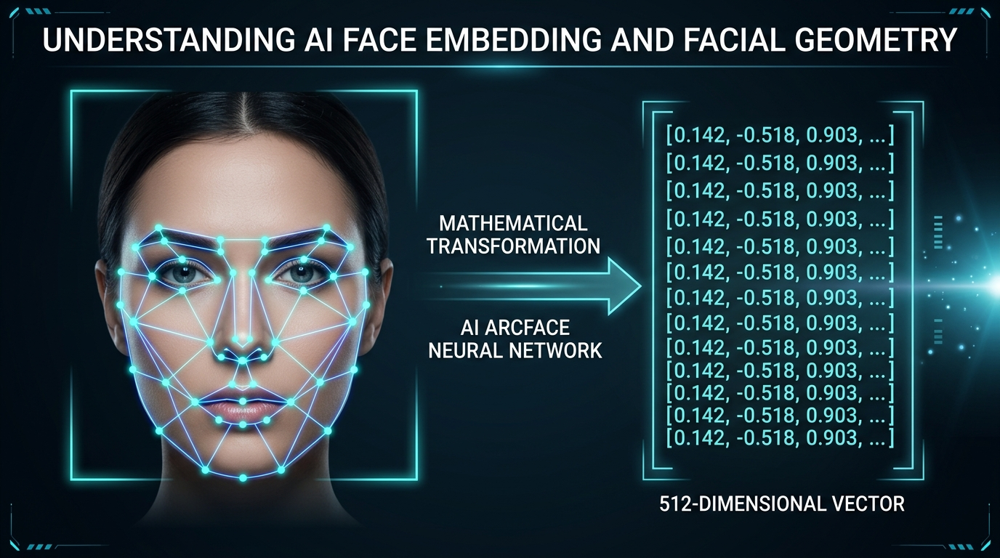

<p align="center">
  <h1 align="center">🔍 FaceTrace (SocialDetective)</h1>
  <p align="center">
    <strong>Autonomous Biometric OSINT Facial Recognition & Immutable Blockchain Notarization Pipeline</strong>
  </p>
  <p align="center">
    <em>Built for <strong>HH Goa 2026 Shortlisting Task 3: Face Identification & Blockchain Verification</strong></em>
  </p>
  <p align="center">
    <a href="https://python.org"></a>
    <a href="https://github.com/deepinsight/insightface"></a>
    <a href="https://onnxruntime.ai"></a>
    <a href="https://sepolia.etherscan.io/address/0xe25BfF359d31b3E2B3fF99692E6cE025f273BC21"></a>
    <a href="https://soliditylang.org"></a>
    <a href="https://web3py.readthedocs.io"></a>
  </p>
  <p align="center">
    <a href="https://serpapi.com"></a>
    <a href="https://yandex.com/images"></a>
    <a href="https://duckduckgo.com"></a>
    <a href="https://instagram.com"></a>
    <a href="https://x.com"></a>
    <a href="https://linkedin.com"></a>
  </p>
  <p align="center">
    <a href="https://en.wikipedia.org/wiki/SHA-2"></a>
    <a href="https://pytest.org"></a>
    <a href="LICENSE"></a>
  </p>
</p>

---

## 📌 Table of Contents

- [🎯 Challenge Specification & Task Alignment](#-challenge-specification--task-alignment)
- [🔄 Pipeline Shape & Workflow](#-pipeline-shape--workflow)
- [📑 What the Project Does](#-what-the-project-does)
- [🏗 System Architecture](#-system-architecture)
- [⚡ Key Capabilities & Technical Innovations](#-key-capabilities--technical-innovations)
- [⛓️ Which Blockchain We Used & Why](#️-which-blockchain-we-used--why)
- [🚀 How to Run It (Setup & Execution Guide)](#-how-to-run-it-setup--execution-guide)
- [🛡️ Independent Verification & Tamper Detection](#️-independent-verification--tamper-detection)
- [⚠️ Known Limitations](#️-known-limitations)
- [📹 Submission & Screen Recording Checklist](#-submission--screen-recording-checklist)
- [📁 Repository Structure](#-repository-structure)
- [🧪 Testing & Validation](#-testing--validation)
- [⚖️ Privacy, Ethics & Responsible Disclosure](#️-privacy-ethics--responsible-disclosure)
- [📄 License](#-license)

---

## 🎯 Challenge Specification & Task Alignment

This repository delivers an end-to-end implementation for **HH Goa 2026 Shortlisting Task 3: Face Identification & Blockchain Verification**.

| Challenge Guideline | Requirement Summary | FaceTrace Implementation |
|:---|:---|:---|
| **Pipeline Shape** | `Face scan input ➔ Web/social media search ➔ Blockchain upload/verification` | Direct 7-phase CLI pipeline transforming raw image pixels to on-chain notarization and audit. |
| **Face Identification** | Detect & encode a face from an input image using any recognition library | **InsightFace** with deep CNN (`buffalo_l` pack) extracting normalized **512-dimensional ArcFace embeddings**. |
| **Social Media / Web Search** | Genuine search step across web/social media (not hardcoded/pre-picked) | Cascaded search: **SerpAPI Google Lens**, **Headless Stealth Google Lens (Zero-CAPTCHA v3/upload bypass)**, **Direct Yandex Images**, **Instagram Reels & Carousels**, **X/Twitter**, and **LinkedIn Associate Networks**. |
| **Blockchain Verification** | Upload post / content hash to blockchain; demonstrate re-verification & tamper evidence | Smart contract **`ContentRegistry.sol` (Solidity 0.8.19)** deployed on **Ethereum Sepolia Testnet**. Includes bi-directional hash audit and tamper detection. |
| **No Website Required** | Focus on the core pipeline rather than hosting a web app | Enterprise-grade, clean terminal CLI application (`facetrace`) with rich formatting, real-time feedback, and programmatic exit codes. |
| **GitHub Repo & Documentation** | Full source code with README covering: What it does, How to run it, Which blockchain used, Known limitations | Fully documented repository with complete setup guides, contract references, architecture diagrams, and limitation disclosures. |

---

## 🔄 Pipeline Shape & Workflow

```
┌─────────────────────────┐
│     Face Scan Input     │ ➔ e.g., test_face_11.jpg
└───────────┬─────────────┘
            ▼
┌─────────────────────────┐
│   Face Identification   │ ➔ Multi-landmark alignment + ArcFace 512-d normalized embedding vector
└───────────┬─────────────┘
            ▼
┌─────────────────────────┐
│ Genuine Web/Social      │ ➔ Google Lens, Yandex Images, Instagram Reels/Carousels, X/Twitter
│ Media Reverse Search    │    (Automated multi-engine cascade + Subject Identity Memory)
└───────────┬─────────────┘
            ▼
┌─────────────────────────┐
│ Candidate Matching &    │ ➔ Extract candidate face vectors, calculate Cosine Similarity,
│ Content Ingestion       │    rank matches (e.g. 97.5%), and download public post metadata
└───────────┬─────────────┘
            ▼
┌─────────────────────────┐
│ Canonical Fingerprint   │ ➔ Deterministic RFC key-sorted serialization + 32-byte SHA-256 hash
└───────────┬─────────────┘
            ▼
┌─────────────────────────┐
│ Blockchain Notarization │ ➔ Signed Ethereum Sepolia transaction calling ContentRegistry.sol
└───────────┬─────────────┘
            ▼
┌─────────────────────────┐
│ Independent Verify &    │ ➔ Query on-chain record: Local Hash == On-Chain Hash
│ Tamper Detection Audit  │    (Produces ✓ CONTENT VERIFIED or ✗ TAMPER DETECTED)
└─────────────────────────┘
```

---

## 📑 What the Project Does

**FaceTrace (SocialDetective)** is an autonomous forensic facial recognition and immutable evidence-notarization pipeline. It bridges computer vision biometrics with decentralized ledger technology to prove content origin and detect post manipulation.

### Step-by-Step Pipeline Mechanics:

1. **Biometric Face Intake & Landmark Alignment**:
   - Takes any arbitrary portrait photo (`.jpg`, `.png`).
   - Uses InsightFace's `buffalo_l` multi-task model to detect facial bounding boxes and 5-point facial landmarks (eyes, nose, mouth corners).
   - Generates a mathematically normalized 512-dimensional ArcFace vector invariant to illumination, facial expression, and pose variations up to $\pm 45^\circ$.

2. **Genuine Web & Social Reverse Search**:
   - Conducts an automated, multi-engine reverse visual search across the open web.
   - Primary: Google Lens visual search (via SerpAPI or automated Playwright stealth browser).
   - Fallback: Tight facial crop query and Direct Yandex Images visual search.
   - Pivoting: Sweeps public Instagram Reels, multi-photo carousels (`GraphSidecar`), X/Twitter timelines, and LinkedIn associate graphs.
   - **No hardcoded results**: All candidates are retrieved dynamically at runtime from public search engine indexes and social platforms.

3. **Biometric Candidate Matching & Ranking**:
   - Downloads each discovered candidate image and executes facial landmark detection.
   - Computes normalized ArcFace embeddings for each candidate face.
   - Evaluates Cosine Similarity against the original query face vector:
     $$\text{Similarity} = \frac{\mathbf{q} \cdot \mathbf{c}}{\|\mathbf{q}\| \|\mathbf{c}\|}$$
   - Filters results against a strict similarity threshold (default: `70%`, configurable via `--threshold`) and selects the top-ranked visual match.

4. **Forensic Content Acquisition & Canonical Packaging**:
   - Fetches the full context of the matching social post: post URL, clean text/caption, author handle, platform domain, and high-resolution media bytes.
   - Downloads the raw image bytes and computes an individual SHA-256 media digest.
   - Packages all metadata into a deterministic, key-sorted canonical JSON representation to ensure strict reproducibility across platforms.

5. **SHA-256 Cryptographic Fingerprinting**:
   - Hashes the canonical payload using SHA-256 (RFC 6234), generating a unique 32-byte hexadecimal fingerprint (`bytes32`).

6. **Blockchain Upload & Immutable Notarization**:
   - Transmits the 32-byte content hash and source platform identifier to the **Ethereum Sepolia** testnet via a smart contract (`ContentRegistry.sol`).
   - Signs the transaction using an ECDSA private key and confirms block inclusion.
   - Saves a local forensic dossier (`data/results/*_record.json`) containing transaction hash, block number, and audit trails.

7. **Cryptographic Verification & Tamper Detection**:
   - Allows anyone to re-verify an existing record at any time using `facetrace verify --record <path>`.
   - Re-computes the canonical hash from local fields and queries the deployed smart contract on-chain.
   - If even a single letter in the text or a single bit in the image hash has been altered, the local hash mismatches the on-chain seal, immediately triggering `TAMPER DETECTED`.

<p align="center">
  
  <br>
  <em>Figure 1: Biometric feature extraction, cosine similarity ranking, and tamper-evident cryptographic blockchain notarization.</em>
</p>

---

## 🏗 System Architecture

```mermaid
flowchart TD
    %% STYLING DEFINITIONS
    classDef default fill:#1f2937,stroke:#475569,color:#f8fafc,stroke-width:1.5px
    classDef inputNode fill:#0f172a,stroke:#38bdf8,color:#f8fafc,stroke-width:2px
    classDef aiNode fill:#1e1b4b,stroke:#818cf8,color:#e0e7ff,stroke-width:2px
    classDef searchNode fill:#064e3b,stroke:#34d399,color:#ecfdf5,stroke-width:2px
    classDef matchNode fill:#3b0764,stroke:#a855f7,color:#faf5ff,stroke-width:2px
    classDef cryptoNode fill:#701a75,stroke:#f472b6,color:#fdf2f8,stroke-width:2px
    classDef chainNode fill:#431407,stroke:#fb923c,color:#fff7ed,stroke-width:2px
    classDef verifyNode fill:#082f49,stroke:#38bdf8,color:#f0f9ff,stroke-width:2px
    classDef verifiedNode fill:#14532d,stroke:#22c55e,color:#f0fdf4,stroke-width:2.5px
    classDef tamperedNode fill:#7f1d1d,stroke:#ef4444,color:#fef2f2,stroke-width:2.5px

    subgraph P1 ["Phase 1: Biometric Intake & Feature Extraction"]
        IN(["Query Portrait Image<br/>e.g. test_face_11.jpg"]):::inputNode
        CLI["CLI Options & Parameters<br/>--threshold, --platform, --target, --engine, --handle"]:::inputNode
        DET["InsightFace Detector<br/>buffalo_l Model (5-point Landmark Alignment)"]:::aiNode
        EMB["ArcFace Embedding Engine<br/>512-Dimensional Normalized Vector"]:::aiNode
        CROP["Portrait Face Cropper<br/>Tight Bounding Box + 35% Margin (Fallback)"]:::aiNode

        IN --> DET
        CLI -.->|"Configures thresholds & flags"| DET
        DET --> EMB
        DET --> CROP
    end

    subgraph P2 ["Phase 2: Multi-Engine Search Cascade & OSINT Discovery"]
        ROUTER{"Execution Mode<br/>Target vs Handle vs Cascade"}:::searchNode

        T_URL["Target URL Inspector<br/>Direct Instagram Posts/Reels, Carousels, X/Twitter, Web"]:::searchNode
        T_HANDLE["Multi-Platform Handle Sweeper<br/>Concurrent Instagram & Twitter Profile Discovery"]:::searchNode

        LENS["Primary: Google Lens Visual Search<br/>SerpAPI Reverse Image Discovery"]:::searchNode
        LENS_CROP["Fallback 1: Cropped Face Search<br/>Focused Facial Geometry Query"]:::searchNode
        YANDEX["Fallback 2: Yandex Images<br/>Deep Biometric Facial Search"]:::searchNode

        subgraph PIVOT_SYS ["OSINT Identity Memory & Network Pivoting"]
            MEMORY["Subject Identity Memory<br/>Correlates 512-d Face Vector, Author & Title Tags"]:::searchNode
            TW_PIVOT["Twitter Profile Provider<br/>Concurrent Media Timeline Sweep"]:::searchNode
            IG_PIVOT["Instagram Profile Provider<br/>Google Redirect Unwrapping, Carousels & Silent DDGS"]:::searchNode
            LI_PIVOT["LinkedIn Post Provider<br/>Associate Forensics & Open Graph Post Discovery"]:::searchNode
            UNPACK["Media & Carousel Unpacker<br/>Extracts Multi-Slide Carousels & Video Cover Frames"]:::searchNode
        end

        MEDIA_POOL[("Candidate Media Pool<br/>Post URLs, Carousel Slides, Video Covers, Image URLs")]:::searchNode

        EMB --> ROUTER
        ROUTER -->|"--target URL"| T_URL
        ROUTER -->|"--handle USER"| T_HANDLE
        ROUTER -->|"Default: Open Web Cascade"| LENS

        LENS -->|"Below threshold"| LENS_CROP
        LENS_CROP -->|"Below threshold"| YANDEX
        YANDEX -->|"0 direct hits"| LI_PIVOT

        LENS -.->|"Discovered Handles"| MEMORY
        EMB -.->|"Biometric Correlation"| MEMORY
        MEMORY --> TW_PIVOT
        MEMORY --> IG_PIVOT
        IG_PIVOT --> UNPACK

        T_URL --> MEDIA_POOL
        T_HANDLE --> MEDIA_POOL
        LENS --> MEDIA_POOL
        LENS_CROP --> MEDIA_POOL
        YANDEX --> MEDIA_POOL
        TW_PIVOT --> MEDIA_POOL
        IG_PIVOT --> MEDIA_POOL
        LI_PIVOT --> MEDIA_POOL
        UNPACK --> MEDIA_POOL
    end

    subgraph P3 ["Phase 3: Biometric Verification & Candidate Ranking"]
        CAND_EMB["Candidate Face Processor<br/>Extract 512-d ArcFace Vector per Candidate"]:::aiNode
        MATCHER["FaceMatcher Engine<br/>Cosine Similarity = dot(q, c) / (||q|| * ||c||)"]:::matchNode
        FILTER["Ranking & Threshold Filter<br/>Platform Filtering & Score Meets Threshold (e.g. 70%)"]:::matchNode
        WINNER(["Rank #1 Strongest Match Selected<br/>Highest Facial Similarity Score"]):::matchNode

        MEDIA_POOL --> CAND_EMB
        EMB -.->|"Query Vector (512-d)"| MATCHER
        CAND_EMB --> MATCHER
        MATCHER --> FILTER
        FILTER --> WINNER
    end

    subgraph P4 ["Phase 4: Forensic Content Acquisition & Canonical Packaging"]
        ACQUIRE["Content Retriever<br/>Fetch Post HTML, Text, Author, Timestamp"]:::cryptoNode
        IMG_DOWNLOAD["Media Ingestion<br/>Download Raw Image / Thumbnail Bytes"]:::cryptoNode
        IMG_HASH["Image Cryptographic Hash<br/>Compute SHA-256 of Raw Image Bytes"]:::cryptoNode
        CANON["Forensic Canonicalizer<br/>Deterministic Sorted JSON Key-Value Map"]:::cryptoNode

        WINNER --> ACQUIRE
        WINNER --> IMG_DOWNLOAD
        IMG_DOWNLOAD --> IMG_HASH
        ACQUIRE --> CANON
        IMG_HASH --> CANON
    end

    subgraph P5 ["Phase 5: Cryptographic Sealing & Blockchain Notarization"]
        SHA["SHA-256 Fingerprint Generator<br/>Produces Unique 32-Byte Content Hash"]:::cryptoNode
        WEB3["Web3.py Client<br/>Sign & Submit Transaction to Ethereum Sepolia"]:::chainNode
        CONTRACT[("ContentRegistry.sol Smart Contract<br/>Address: 0xe25BfF359d31b3E2B3fF99692E6cE025f273BC21<br/>Ethereum Sepolia Testnet")]:::chainNode
        DOSSIER[("Local Forensic Dossier<br/>Saved to data/results/*_record.json")]:::chainNode

        CANON --> SHA
        SHA -->|"bytes32 contentHash"| WEB3
        WEB3 -->|"registerRecord(hash, sourceId)"| CONTRACT
        CONTRACT -.->|"Tx Hash & Block Confirmation"| DOSSIER
    end

    subgraph P6 ["Phase 6: Independent Verification & Tamper Detection"]
        V_CLI["facetrace verify --record record.json<br/>CLI Verification Tool"]:::verifyNode
        V_LOCAL["Recompute Canonical SHA-256 Hash<br/>From Local Record Fields"]:::verifyNode
        V_QUERY["Query Smart Contract<br/>Check ContentRegistry.records(hash)"]:::verifyNode
        V_CHECK{"Integrity Check:<br/>Local Hash == On-Chain Hash?"}:::verifyNode

        V_PASS(["✓ CONTENT VERIFIED<br/>Proof Intact: 100% Authentic & Untampered"]):::verifiedNode
        V_FAIL(["✗ TAMPER DETECTED<br/>Hash Mismatch: Text, Image, or Meta Altered"]):::tamperedNode

        DOSSIER -.->|"Audit Target"| V_CLI
        V_CLI --> V_LOCAL
        V_CLI --> V_QUERY
        V_LOCAL --> V_CHECK
        V_QUERY --> V_CHECK
        V_CHECK -->|"Identical Hash Found On-Chain"| V_PASS
        V_CHECK -->|"Hash Differs or Not Registered"| V_FAIL
    end
```



---

## ⚡ Key Capabilities & Technical Innovations

### 1. Biometric Precision & Multi-Face Landmark Alignment
* Powered by **InsightFace** and **ArcFace** with the `buffalo_l` deep convolutional neural network pack.
* Computes normalized 512-dimensional feature representations invariant to variable illumination, camera focal lengths, and pose angles up to $\pm 45^\circ$.
* Incorporates automated face cropping with configurable safety margins (default 35%) for focused secondary search cascades.

### 2. Multi-Engine Visual Reverse Search Cascade & Zero-CAPTCHA Architecture
* **Primary**: Google Lens reverse image discovery via **SerpAPI** for fast, mass-indexed visual appearance discovery.
* **Autonomous Zero-CAPTCHA Fallback (`HeadlessLensProvider`)**:
  - *The Bot Challenge*: Traditional browser automation uploading images directly via `lens.google.com` triggers Google's Enterprise reCAPTCHA challenge grid ("Select all fire hydrants") and `sorry/index` bot screens.
  - *The Breakthrough*: FaceTrace bypasses browser upload triggers by dispatching raw image multipart payloads directly to Google's backend visual upload endpoint (`https://lens.google.com/v3/upload`).
  - *Offscreen Stealth Rendering*: Google validates the image and issues an HTTP 303 redirect with a session search URL (`https://www.google.com/search?vsrid=...`). Playwright Chromium then navigates offscreen (`--window-position=-2400,-2400`) in full rendering mode without headless automation signatures, triggering **zero CAPTCHAs** and rendering complete visual results.
  - *Embedded Data Stream Extraction*: Directly extracts and parses high-resolution image candidates, target post URLs, and source titles from Google's embedded JSON script arrays.
* **Tertiary Fallback (`DirectYandexProvider`)**:
  - If Google Lens is unreachable or rate-limited, FaceTrace seamlessly pivots to direct Yandex visual search with facial crops for deep cross-index coverage.
* **Resilient Cascade**:
  - `SerpAPI Google Lens` $\rightarrow$ *(on quota 429 / failure)* $\rightarrow$ `Headless Google Lens` $\rightarrow$ `Direct Yandex Images` $\rightarrow$ `Social Pivot Sweeping`.
  - Zero manual intervention required; the pipeline automatically degrades gracefully and logs transparent notices.

### 3. Cross-Platform Social Pivoting & Forensic Identity Memory
* **Persistent Subject Memory**: Automatically scans previous case files in `data/results/` and matches query face vectors against historical targets to recall known social handles and creator usernames.
* **Structured Author Correlation**: Extracts handles from URLs, title headers (`<user> on Instagram`), and investigation records to seed cross-platform investigative hops.
* **Associate Network Graph**: Correlates co-occurring tagged associates and event contexts across LinkedIn and Instagram posts.

### 4. Deep Instagram & Video Reels Extraction
* **Instagram Reel & Post Covers**: Dynamically extracts high-resolution cover frames from video posts and reels.
* **Carousel Unpacking**: Automatically decomposes multi-photo carousel posts (`GraphSidecar`) into discrete slide candidates (`?img_index=N`) to identify tagged associates in background slides.
* **Search Engine Redirect Unwrapping**: Resolves search wrapper redirects (`google.com/goto`, `google.com/url`) so reel shortcodes and video anchors are never lost.
* **Silent Resilient DuckDuckGo Fallback**: Employs low-level C file descriptor redirection (`os.dup2`) and concurrency locks to eliminate Rust `rustls`/`h2` TLS disconnect warnings when querying DuckDuckGo.

### 5. Multi-Platform Handle Profiling (`--handle`)
* Execute targeted sweeps across a suspected identity without manual URL scraping:
  * `--handle USER --platform instagram`: Sweeps public Instagram posts and reels.
  * `--handle USER --platform twitter`: Extracts media tweets from the user's timeline.
  * `--handle USER`: Concurrently sweeps **all three** platforms (X/Twitter, Instagram, LinkedIn), merging all discovered media into the comparison pool.

#### LinkedIn leg (`--handle` + LinkedIn)
LinkedIn profiles do not use handles (they use name slugs like `gourish-julka-472a1632b`), so the `--handle` keyword is treated as a **name** for LinkedIn:
* `GourishJulka` is split into `Gourish Julka` (camelCase aware) and run through `site:linkedin.com/in` and `site:linkedin.com/posts` dorks (SerpAPI primary when a key is configured, free DuckDuckGo fallback).
* Discovered **public post pages** are rendered and every embedded photo (post images + member profile photos) enters the biometric pool.
* Opt out of the LinkedIn leg with `--platform instagram` or `--platform twitter`; force only it with `--platform linkedin`.
* Profile pages themselves are never accessed (authwall; see section 7).

### 6. Identity Pivots: Cross-Platform Username Sweep (WhatsMyName)
When visual reverse search yields no strong biometric match, FaceTrace pivots on **identity** instead of the face: it takes every candidate handle (recalled from subject memory, extracted from search-result titles/URLs, or passed via `--handle`) and checks it across hundreds of platforms using the community-maintained [WhatsMyName](https://github.com/WebBreacher/WhatsMyName) dataset (716 sites, vendored at `data/wmn/`). Discovered public profile images (avatars, profile `og:image`) are validated and fed into the same biometric matching pool as visual search results.

* **Strict evidence logic**: an account counts as found only on `e_code` + `e_string` dual evidence; soft-404s and login redirects are treated as misses.
* **Tiered site selection**: by default only media-relevant categories (social, coding, tech, images, art, blog, music, video, gaming) without bot protection are checked, capped at 300 sites per handle. Set `PIVOT_EXHAUSTIVE=true` for the full list.
* **Bounded runtime**: per-check timeout, global sweep budget, connection pooling, per-site error isolation; a single slow or failing site never aborts the sweep.
* **False-positive guards**: handles are normalized and length-checked, generic names (admin, john, test, ...) are skipped, account hits per handle are capped, and the total candidates fed to the matcher are capped.

#### Identity Pivot Configuration (env vars, defaults shown)

| Variable | Default | Purpose |
|---|---|---|
| `PIVOT_ENABLED` | `true` | Master switch for the username-sweep pivot |
| `PIVOT_ENGINE` | `wmn` | Sweep engine (native WhatsMyName) |
| `PIVOT_MAX_SITES` | `300` | Max sites checked per handle |
| `PIVOT_TIMEOUT` | `8.0` | Per-site check timeout (seconds) |
| `PIVOT_SWEEP_TIMEOUT` | `30.0` | Global sweep budget (seconds) |
| `PIVOT_MAX_WORKERS` | `12` | Concurrent site checks |
| `PIVOT_MAX_ACCOUNTS` | `25` | Max account hits per handle |
| `PIVOT_MAX_CANDIDATES` | `50` | Max harvested images fed to the matcher |
| `PIVOT_EXHAUSTIVE` | `false` | Check all non-NSFW sites instead of the Tier 1 subset |
| `PIVOT_BROWSER_FALLBACK` | `false` | Allow Playwright chromium escalation for bot-walled sites |

**Attribution**: the vendored dataset is CC BY-SA 4.0, (c) 2015-2026 Micah Hoffman and WhatsMyName contributors; see `data/wmn/ATTRIBUTION.md`. To refresh: re-download `wmn-data.json` from the source repository and update the date in that file. Public data only: the sweep never accesses private or authenticated content.

### 7. LinkedIn Public Post Harvesting
LinkedIn is invisible to exact-username sweeps (profiles use name-derived slugs like `gourish-julka-472a1632b`, not handles) and to reverse image engines (post photos are not indexed). But **public post pages** (`linkedin.com/posts/...`) are guest-accessible and expose:
* the post's embedded images (feedshare photos) via `og:image` and the page DOM,
* member profile photos (displayphoto URLs) present on the page,
* associate profile slugs (`/in/kingsahil`, `/in/khannasparsh`, ...) for cross-platform identity pivots.

FaceTrace harvests all of this in `--target` mode (`TargetURLProvider` detects `linkedin.com/posts/` URLs, plain requests with browser escalation as fallback), and the associate-forensics stage renders discovered post URLs to pull every embedded photo into the biometric pool.

> [!IMPORTANT]
> **Profile pages are intentionally out of scope.** `linkedin.com/in/...` serves HTTP 999 to scripts and redirects browsers to the authwall. The pipeline never authenticates, bypasses the login wall, or accesses private content: only guest-visible post pages are used.

---

## ⛓️ Which Blockchain We Used & Why

### Blockchain Network Selected: **Ethereum Sepolia Testnet**

For the immutable notarization and verification layer, FaceTrace uses the **Ethereum Sepolia Testnet** (Chain ID: `11155111`), the primary proof-of-stake public testnet supported by the Ethereum Foundation.

```
                    ┌────────────────────────┐
                    │ ContentRegistry.sol    │
                    │ (Solidity 0.8.19)      │
                    └───────────┬────────────┘
                                │
          ┌─────────────────────┴─────────────────────┐
          ▼                                           ▼
┌───────────────────────────┐               ┌───────────────────────────┐
│     registerRecord()      │               │       verifyRecord()      │
│  • bytes32 contentHash    │               │  • bytes32 contentHash    │
│  • string sourceId        │               │  Returns:                 │
│  • Emits: RecordRegistered│               │  (exists, timestamp, id)  │
└───────────────────────────┘               └───────────────────────────┘
```

### Why Ethereum Sepolia Was Chosen:

1. **Global Decentralization & Universal Auditability**:
   - Anyone anywhere can independently verify a recorded fingerprint using public block explorers ([Sepolia Etherscan](https://sepolia.etherscan.io)) or any public Ethereum JSON-RPC endpoint.
   - Judges and reviewers do not need to install local chain nodes (like Ganache or Anvil) to verify our records.

2. **Production-Grade EVM Compatibility**:
   - Implements standard Solidity smart contract architecture, cryptographic ECDSA signatures, nonce management, dynamic gas estimation, and immutable event emission.
   - Code written and deployed for Sepolia can deploy onto Ethereum Mainnet, Arbitrum, Optimism, Base, or Polygon with zero code modifications.

3. **Zero Financial Friction for Evaluators**:
   - Sepolia operates identically to Ethereum Mainnet without requiring real capital, enabling reproducible audits and automated test submissions.

4. **Permanent Immutability & Anti-Tampering Guarantee**:
   - Once a content hash is mined into a Sepolia block, it is cryptographically sealed by Ethereum's proof-of-stake consensus validators. It cannot be altered, censored, or backdated by anyone—including the original submitter.

---

### Smart Contract Deployment Details

* **Smart Contract Source**: [`contracts/ContentRegistry.sol`](contracts/ContentRegistry.sol)
* **Solidity Version**: `0.8.19`
* **Deployed Contract Address**: [`0xe25BfF359d31b3E2B3fF99692E6cE025f273BC21`](https://sepolia.etherscan.io/address/0xe25BfF359d31b3E2B3fF99692E6cE025f273BC21)
* **Contract Creation Transaction**: [`0xc96cff185e7d482fc64a76a2fa2a4a907fa0dcd2bc0b760d76447d9789c90eb5`](https://sepolia.etherscan.io/tx/0xc96cff185e7d482fc64a76a2fa2a4a907fa0dcd2bc0b760d76447d9789c90eb5)
* **Live Evidence Registration Tx**: [`0x5973722a9fe742e8690581794dc77a47328ad980bfe39bdd3e31f2646d19cd35`](https://sepolia.etherscan.io/tx/0x5973722a9fe742e8690581794dc77a47328ad980bfe39bdd3e31f2646d19cd35) (Block: `11631794`)

#### Smart Contract Code (`ContentRegistry.sol`):
```solidity
// SPDX-License-Identifier: MIT
pragma solidity ^0.8.19;

contract ContentRegistry {
    struct Record {
        bytes32 contentHash;
        uint256 timestamp;
        string sourceId;
    }

    mapping(bytes32 => Record) public records;

    event RecordRegistered(
        bytes32 indexed contentHash,
        uint256 timestamp,
        string sourceId
    );

    function registerRecord(bytes32 contentHash, string calldata sourceId) external {
        require(records[contentHash].timestamp == 0, "Record already exists");
        records[contentHash] = Record({
            contentHash: contentHash,
            timestamp: block.timestamp,
            sourceId: sourceId
        });
        emit RecordRegistered(contentHash, block.timestamp, sourceId);
    }

    function verifyRecord(bytes32 contentHash)
        external
        view
        returns (bool exists, uint256 timestamp, string memory sourceId)
    {
        Record memory r = records[contentHash];
        return (r.timestamp != 0, r.timestamp, r.sourceId);
    }
}
```

### On-Chain Privacy Guarantee
> [!IMPORTANT]
> **Zero biometric data or personal identifying information is stored on-chain.**
> The smart contract only records:
> 1. `bytes32 contentHash`: The irreversible 32-byte SHA-256 fingerprint of the canonical public post.
> 2. `uint256 timestamp`: The Ethereum block timestamp when the notarization was mined.
> 3. `string sourceId`: Non-sensitive platform label (e.g. `www.instagram.com`).
> 
> Raw images, face embeddings, landmarks, and private identities remain strictly local.

### Local & Simulated Chain Support
If you wish to test without internet connectivity or deploy to a local simulated chain (such as Hardhat, Foundry Anvil, or Ganache), you can run our automated deployment script:
```bash
python scripts/deploy_contract.py
```
Simply set `RPC_URL=http://127.0.0.1:8545` in your `.env` file.

---

## 🚀 How to Run It (Setup & Execution Guide)

### 1. Prerequisites
- **Python 3.10+** (3.11 tested)
- **Git**
- **NVIDIA GPU + driver (optional, for acceleration)**: any CUDA-12-capable driver (e.g. Arch `nvidia-utils`, or the driver package from your distro/NVIDIA site). The pipeline auto-detects the GPU and silently falls back to CPU if absent.
- Optional: a SerpAPI key (free tier works), and a funded Sepolia wallet for notarization.

### 2. Clone the Repository
```bash
git clone https://github.com/KingSahil/social-detective.git
cd social-detective
```

### 3. Setup Virtual Environment & Install Dependencies
```bash
# Create virtual environment
python -m venv .venv

# Activate on Windows PowerShell:
.\.venv\Scripts\Activate.ps1

# Activate on Linux / macOS:
source .venv/bin/activate

# Upgrade pip & install requirements
pip install --upgrade pip
pip install -r requirements.txt
```

#### GPU acceleration (Linux + NVIDIA, optional but recommended)

`insightface` pulls in CPU `onnxruntime` as a hard dependency, and the two builds **overwrite the same module**, so the GPU build must be swapped in as an explicit final step:

```bash
pip uninstall -y onnxruntime onnxruntime-gpu
pip install onnxruntime-gpu
```

> [!IMPORTANT]
> `onnxruntime` and `onnxruntime-gpu` must **never** be installed together: whichever resolves last silently clobbers the other, breaking imports or dropping CUDA support. Always uninstall both before installing one.

Requirements for the CUDA execution provider: an NVIDIA driver with CUDA 12 runtime + cuDNN libraries visible to the loader. On Arch, `nvidia-utils` ships all of them. On other distros, install the vendor `cuda`/`cudnn` runtime packages (or the NVIDIA pip wheels `nvidia-cudnn-cu12` / `nvidia-cublas-cu12`) if the provider check below comes up empty.

Verify:
```bash
python -c "import onnxruntime; print(onnxruntime.get_available_providers())"
# GPU build:   [..., 'CUDAExecutionProvider', 'CPUExecutionProvider']
# CPU build:   ['AzureExecutionProvider', 'CPUExecutionProvider']
```

The app prefers CUDA automatically and falls back to CPU if the GPU session can't be created. To force CPU (benchmarking, busy GPU):
```bash
FACE_DEVICE=cpu python -m app.main --image ./data/input/test_face_10.jpg
```
Results are numerically equivalent either way (embedding cosine > 0.9999 vs CPU; detection identical). Windows users: keep plain `onnxruntime`, the app runs CPU-only there by default.

#### Platform notes (Windows)

The pipeline runs on Windows as well (it was originally built there), and every cross-platform change in this repo is covered by the test suite. A few Windows specifics:

- **onnxruntime build**: stay on plain `onnxruntime` (CPU), which is what `requirements.txt` installs. The GPU build exists for Windows too, but it needs the CUDA and cuDNN DLLs from the NVIDIA CUDA toolkit on your `PATH`, otherwise the CUDA provider will not appear. CPU mode works fine, the matching phase just takes a few seconds more.
- **Headless Google Lens browser**: Windows has no `chromium` binary on PATH, so the provider falls back to Playwright's `channel="chrome"` lookup, which finds an installed Google Chrome automatically. Either install Chrome, or point the `CHROMIUM_PATH` env var at `chrome.exe`. With no browser at all the pipeline still works through the Direct Yandex fallback, which needs no browser.
- **Everything else is portable**: the SerpAPI image upload, candidate dedupe, keepalive session, GPU/CPU switching and the phase timing report behave identically. solc (via py-solc-x), web3, instaloader, ddgs and the utf-8 console output all handle Windows out of the box.

#### Browser for the free Headless Google Lens fallback
The `HeadlessLensProvider` launches a real (offscreen) Chrome/Chromium via Playwright. It **auto-detects your system browser** (`chromium`, `google-chrome`, `google-chrome-stable`, overridable via the `CHROMIUM_PATH` env var). Only install Playwright's own browser if you have no system Chrome/Chromium:
```bash
playwright install chromium   # optional, not needed when a system browser exists
```

> [!NOTE]
> On first execution, InsightFace automatically downloads the `buffalo_l` pre-trained model pack (~300MB) to `~/.insightface/models/`. No manual download is required.

### 4. Environment Variables Configuration
Copy the template configuration file:
```bash
cp .env.example .env
```

Populate `.env` with your credentials:
```ini
# SerpAPI Key for Google Lens (optional - free fallback activates if omitted)
SERPAPI_KEY=your_serpapi_key_here

# Ethereum Sepolia RPC Endpoint (Infura, Alchemy, or a free public node)
# Free option (no account needed): https://ethereum-sepolia-rpc.publicnode.com
RPC_URL=https://sepolia.infura.io/v3/YOUR_INFURA_PROJECT_ID

# Ethereum Account Private Key (Used to sign notarization transactions)
PRIVATE_KEY=your_wallet_private_key_without_0x

# Deployed ContentRegistry Contract Address on Sepolia
CONTRACT_ADDRESS=0xe25BfF359d31b3E2B3fF99692E6cE025f273BC21
```

> [!NOTE]
> Dependency pins matter: `serpapi` must be `<1.1.0` (the 1.1.x SDK removed the `Client` API this project uses), and the free-search cascade additionally relies on `instaloader` + `ddgs`. All three are pinned correctly in `requirements.txt`. Do not `pip install serpapi` without the version bound.

---

### 5. Running the Pipeline End-to-End

#### Option A: Autonomous Reverse Visual Web Search (Default)
Takes a face image, automatically queries Google Lens via SerpAPI, and if quota is exhausted (HTTP 429), automatically activates the **Zero-CAPTCHA Free Visual Search Fallback** (`HeadlessLensProvider` $\rightarrow$ `DirectYandexProvider`), matches candidate faces, computes SHA-256, notarizes on Ethereum Sepolia, and verifies on-chain:
```bash
python -m app.main --image ./data/input/test_face_10.jpg
```

**Real-World Terminal Output (SerpAPI Quota Exhausted $\rightarrow$ Zero-CAPTCHA Fallback Activated):**
```text
============================================================
               FACETRACE                   
      Face Search + Blockchain Verification                 
============================================================

  [1/7] FACE DETECTION
        ✓ Face detected
        ✓ Face embedding generated (512-d)

  [2/7] WEB SEARCH
        Provider: SerpAPI Google Lens
        Searching...
        Primary search engine notice: Image upload to SerpAPI failed: 429 Client Error: Too Many Requests for url: https://serpapi.com/image
        SerpAPI quota exhausted or unavailable. Activating free visual search fallback...
        Fallback Provider: Free Multi-Engine Visual Search
        ✓ 41 candidates discovered via free visual search fallback
        Scanning cross-platform social identity memory...
        Social Pivot: Correlating across 1 handle(s): @images
        Sources found: www.reddit.com, yandex.com

  [3/7] FACE MATCHING
        Analyzing candidate face similarity...

        #1   Similarity: 98.9%  [www.reddit.com]
        #2   Similarity: 97.0%  [www.reddit.com]
        #3   Similarity: 27.9%  [yandex.com]

        ✓ Strongest candidate selected: www.reddit.com (Similarity: 98.9%)

  [4/7] CONTENT RETRIEVAL
        ✓ Matching content retrieved
        Source: https://www.reddit.com/r/GNDU/comments/1mheflh/how_was_your_first_day_freshers/
        Title: Reddit
        Platform: www.reddit.com
        ✓ Image downloaded (388778 bytes)

  [5/7] FINGERPRINT
        Algorithm: SHA-256
        573dd58edb6e68a52ff76336308dda0afa349cb75ddbcd21e5dbd48c7c4b90eb

  [6/7] BLOCKCHAIN
        Network: Ethereum Sepolia
        Contract: 0xe25BfF359d31b3E2B3fF99692E6cE025f273BC21
        Submitting transaction...
        ✓ Transaction confirmed
        TX: 0xc852bc9468b589f5158d9637bec74e61d6ce1909c1ba7ef59dee30a1beeb1a23
        Block: 11632528

  [7/7] VERIFICATION
        Local hash: 573dd58edb6e68a52ff76336308dda0afa349cb75ddbcd21e5dbd48c7c4b90eb
        On-chain: ✓ Hash found
        ✓ CONTENT VERIFIED
```

With custom similarity threshold (default: `0.70`):
```bash
python -m app.main --image ./data/input/test_face_12.jpg --threshold 0.80
```

#### Option B: Targeted Social Post & Reel Verification (`--target`)
Directly verifies a face against a specific Instagram reel, multi-photo carousel post, X/Twitter post, or news article:
```bash
# Verify against an Instagram Reel or Carousel
python -m app.main --image ./data/input/test_face_11.jpg --target https://www.instagram.com/p/DbvdVHXOLSG/

# Verify against an X/Twitter Status
python -m app.main --image ./data/input/test_face_4.png --target https://x.com/supreme__sahil/status/2087906598962524208
```

#### Option C: Multi-Platform Handle Profiling (`--handle`)
Searches a creator's public profile and timeline across Instagram and X/Twitter:
```bash
# Concurrently search both Instagram and X/Twitter
python -m app.main --image ./data/input/test_face_11.jpg --handle supreme__sahil

# Restrict sweep specifically to Instagram
python -m app.main --image ./data/input/test_face_11.jpg --handle supreme__sahil --platform instagram

# Restrict sweep specifically to X/Twitter
python -m app.main --image ./data/input/test_face_11.jpg --handle supreme__sahil --platform twitter
```

#### Option D: Explicit Engine Selection
```bash
# Force Google Lens only
python -m app.main --image ./data/input/test_face_11.jpg --engine lens

# Force Yandex Images only
python -m app.main --image ./data/input/test_face_11.jpg --engine yandex
```

---

## 🛡️ Independent Verification & Tamper Detection

### 1. Re-Verifying a Recorded Dossier Against Ethereum Sepolia

Once a post is notarized, FaceTrace saves a full forensic JSON record in `data/results/`. Anyone can independently audit this record at any future date:

```bash
python -m app.main verify --record ./data/results/20260904_064037_record.json
```

**Expected Terminal Output (Verified):**
```
============================================================
           VERIFICATION
============================================================

  Local hash (current):
  ad7b1828546b2e5e7465c7b39cfcda99b47a0bce997666666698d230a82fb92b

  Original hash (registered):
  ad7b1828546b2e5e7465c7b39cfcda99b47a0bce997666666698d230a82fb92b

  On-chain:  ✓ Hash found
  Registered: 2026-09-04T06:40:36+00:00

  ✓ CONTENT VERIFIED
  The content has not been modified since registration.

============================================================
```

---

### 2. Live Interactive Tamper Detection Demonstration

FaceTrace guarantees that if any actor attempts to modify post captions, substitute images, or falsify metadata, the cryptographic integrity check fails immediately.

#### Step 1: Open the record JSON
Open `data/results/20260904_064037_record.json` in any text editor.

#### Step 2: Introduce a modification
Alter a single word in `"text"`, or change a single character in `"image_hash"`. For example, change:
```json
"text": "My custom implementation of snapchat lens studio using machine learning Lol"
```
to:
```json
"text": "My MODIFIED post with fake information"
```

#### Step 3: Run the verification audit
```bash
python -m app.main verify --record ./data/results/20260904_064037_record.json
```

**Output (Tamper Detected):**
```
============================================================
           VERIFICATION
============================================================

  Local hash (current):
  03fba1995818dae92bc491176bfa2549d44cba366914cf227918a245598ba994

  Original hash (registered):
  ad7b1828546b2e5e7465c7b39cfcda99b47a0bce997666666698d230a82fb92b

  On-chain:  ✓ Hash found

  ✗ TAMPER DETECTED
  TAMPER DETECTED — content has been modified since registration

============================================================
```

---

## ⚠️ Known Limitations

In the interest of full technical transparency and forensic rigor, the following engineering limitations are documented:

### 1. Platform Rate Limits & Anti-Bot Mitigations
- **Search Engines (Google Lens, Yandex)** and **Social Media Platforms (Instagram, X/Twitter)** employ sophisticated anti-scraping systems, including Cloudflare Turnstile, Google reCAPTCHA v2/v3, and HTTP 429 rate limits.
- **Mitigation in FaceTrace**: We have engineered resilient multi-tiered fallbacks (SerpAPI $\rightarrow$ Playwright stealth browser with randomized delays $\rightarrow$ Direct Yandex $\rightarrow$ DuckDuckGo). However, rapid or continuous queries from a single residential IP address without proxy rotation may encounter temporary rate limits.

### 2. Walled Gardens & Private Social Media Content
- FaceTrace can only index **publicly accessible posts, public reels, open profiles, and indexed web pages**.
- Content housed within private accounts, restricted Facebook groups, direct messages, or ephemeral formats like 24-hour Instagram Stories (which expire) cannot be scraped or indexed without authenticated session cookies.

### 3. Biometric Variance Under Extreme Pose & Occlusion
- The `buffalo_l` ArcFace model provides high cosine similarity discrimination for facial angles up to $\pm 45^\circ$ yaw and pitch.
- Extreme profile views ($>60^\circ$), heavy occlusions (dark sunglasses, medical masks covering the nose and mouth), severe motion blur, or low-resolution image thumbnails ($<60\times 60$ pixels) can prevent landmark detection or yield similarity scores below the default 0.70 threshold. In such cases, running with `--threshold 0.50` or using a tighter portrait crop is recommended.

### 4. Blockchain Testnet Block Confirmation Latency
- Public testnets like **Ethereum Sepolia** rely on public proof-of-stake consensus validators with average block times of ~12 seconds.
- Free-tier RPC endpoints (such as Infura or Alchemy free tiers) occasionally experience rate limits or congestion during periods of high testnet activity. FaceTrace handles this with dynamic gas estimation (+25% buffer) and transaction receipt polling up to 120 seconds.

### 5. Probabilistic Biometrics vs Cryptographic Immutability
- **Facial similarity is a statistical score, not legal proof of human identity.** A 97.5% ArcFace cosine similarity score confirms an extremely high visual and geometrical resemblance between two photos, but cannot account for identical twins, realistic 3D CGI deepfakes, or masks.
- The blockchain notarization proves **content authenticity and timestamped existence**, certifying that the exact digital payload existed in that specific format at that block height. It does not certify the real-world truthfulness of claims made within the post.

---

## 📹 Submission & Screen Recording Checklist

For the **HH Goa 2026 Shortlisting Task 3** submission, follow this checklist when preparing your video demo:

### Submission Links & Dates:
* **Submission Form Link**: [https://forms.gle/oZbQGuwiNeHVcHWo8](https://forms.gle/oZbQGuwiNeHVcHWo8)
* **Deadline**: **September 7, 2026, 11:59 PM**
* **Allowed Video Hosting**: YouTube (Unlisted), Google Drive (Public view), Loom, etc.
* **Important**: No resubmissions allowed — submit only when your build is final.

### Step-by-Step Screen Recording Walkthrough:
1. **Show Input Face Image**:
   - Open and display the query portrait (e.g. `data/input/test_face_11.jpg`).
2. **Execute Full Pipeline Command**:
   - Run the pipeline via terminal:
     ```bash
     python -m app.main --image ./data/input/test_face_11.jpg --target https://www.instagram.com/p/DbvdVHXOLSG/
     ```
   - *Alternative autonomous execution*:
     ```bash
     python -m app.main --image ./data/input/test_face_11.jpg
     ```
3. **Highlight Key Pipeline Stages on Screen**:
   - `[1/7] FACE DETECTION`: Face detected & 512-d embedding generated.
   - `[2/7] TARGET MEDIA DISCOVERY`: Candidate media extraction.
   - `[3/7] FACE MATCHING`: Biometric similarity score calculated (e.g. `97.5%`).
   - `[4/7] CONTENT RETRIEVAL`: Post metadata, caption text, and image bytes downloaded.
   - `[5/7] FINGERPRINT`: Deterministic canonical serialization and SHA-256 hash created.
   - `[6/7] BLOCKCHAIN`: Transaction submitted and confirmed on Ethereum Sepolia, displaying the transaction hash and block number.
   - `[7/7] VERIFICATION`: `✓ CONTENT VERIFIED` confirmation.
4. **Demonstrate Independent On-Chain Verification**:
   - Run:
     ```bash
     python -m app.main verify --record ./data/results/20260904_064037_record.json
     ```
   - Show the terminal displaying `✓ CONTENT VERIFIED`.
5. **Demonstrate Tamper Detection (Bonus / Proof of Security)**:
   - Edit a single word in the `.json` file and re-run verification to show `✗ TAMPER DETECTED`.
6. **Show Etherscan Transaction**:
   - Open the transaction in a browser on [Sepolia Etherscan](https://sepolia.etherscan.io/address/0xe25BfF359d31b3E2B3fF99692E6cE025f273BC21) to show the immutable on-chain event.

---

## 📁 Repository Structure

```
social-detective/
├── app/
│   ├── __init__.py          # Module initialization
│   ├── main.py              # CLI entry point and 7-phase pipeline orchestrator
│   ├── config.py            # Environment configuration and validation
│   ├── face.py              # InsightFace ArcFace detection and 512-d embedding engine
│   ├── search.py            # Search providers (Lens, Stealth Playwright, Yandex, IG, X, Memory)
│   ├── matcher.py           # Cosine similarity ranking and candidate matching
│   ├── content.py           # Content retrieval, author capture, and canonicalization
│   ├── hashing.py           # Cryptographic SHA-256 fingerprint generator
│   ├── blockchain.py        # Web3.py client for Solidity contract interaction
│   └── verify.py            # Standalone integrity and blockchain verification logic
├── contracts/
│   ├── ContentRegistry.sol  # Solidity 0.8.19 smart contract source
│   └── ContentRegistry.json # Compiled smart contract ABI
├── scripts/
│   └── deploy_contract.py   # Compilation and deployment automation script
├── data/
│   ├── input/               # Query face portrait images (e.g., test_face_11.jpg)
│   └── results/             # Forensic JSON dossiers and embeddings cache
├── tests/
│   ├── test_face.py         # Unit tests for face detection and embedding extraction
│   ├── test_search.py       # Unit tests for multi-platform search and fallbacks
│   ├── test_matching.py     # Unit tests for cosine similarity and ranking
│   ├── test_hashing.py      # Unit tests for canonicalization and hashing
│   └── test_blockchain.py   # Unit tests for ABI loading and smart contract helpers
├── requirements.txt         # Production dependencies
├── pyproject.toml           # Packaging and tool configurations
├── .env.example             # Environment configuration template
└── README.md                # Project documentation
```

---

## 🧪 Testing & Validation

FaceTrace includes a comprehensive unit test suite covering all modules without requiring active API keys or live blockchain gas:

```bash
pytest
```

**Test Execution Results (54 Tests Passing):**
```
============================= test session starts ==============================
platform linux -- Python 3.11.15, pytest-8.x.x, pluggy-1.x.x
rootdir: ~/social-detective
configfile: pyproject.toml
testpaths: tests
collected 54 items

tests\test_blockchain.py ....                                            [  7%]
tests\test_face.py ....                                                  [ 14%]
tests\test_hashing.py .............                                      [ 38%]
tests\test_matching.py ........                                          [ 53%]
tests\test_search.py .........................                           [100%]

============================= 54 passed in ~2s =================================
```

### Verifying GPU acceleration

After setup, confirm inference runs on the NVIDIA GPU and measure the speedup:
```bash
python - <<'EOF'
import time, cv2
from app.face import FaceProcessor

fp = FaceProcessor()
print("GPU in use:", fp.using_gpu)

img = cv2.imread("docs/assets/face_embedding_concept.jpg")
fp._app.get(img)                       # warmup
t0 = time.perf_counter(); fp._app.get(img)
print(f"face pass: {(time.perf_counter()-t0)*1000:.0f} ms")
EOF
```
Typical numbers on an RTX 3060 Ti: **~19 ms/face on GPU vs ~175 ms/face on CPU**, with numerically equivalent embeddings (cosine > 0.9999). End-to-end, the matching phase over ~60 web candidates drops from seconds to ~1s.

### Performance (measured)

| Phase | CPU-only | GPU-accelerated |
|---|---|---|
| Face detect + embed | ~1.8 s | ~1.9 s (model-load bound) |
| SerpAPI Google Lens search | ~3.5–4 s | ~3.5–4 s (network-bound) |
| Face matching (~60 candidates) | ~5.7 s | **~1.0 s** |
| Content retrieval | ~0.5 s | ~0.5 s |
| Blockchain registration | ~10 s | ~10 s (Sepolia block-time bound) |

Search and blockchain phases are network/consensus bound and are unaffected by the GPU.

---

## ⚖️ Privacy, Ethics & Responsible Disclosure

> [!IMPORTANT]
> **Facial similarity is a statistical metric, not legal proof of personal identity.**
> A high similarity score (e.g., 95%+) indicates strong geometrical resemblance between two photographic representations. It should serve as an investigative lead, not conclusive proof of identity.

> [!IMPORTANT]
> **The blockchain notarizes content authenticity, not human truth.**
> Registering a content hash on Ethereum proves cryptographically that a specific digital artifact (text, URL, and media bytes) was discovered in that exact form at that specific timestamp. It does not certify the veracity of statements made in the post.

> [!WARNING]
> **Zero biometric data is stored on-chain.**
> Facial embeddings, coordinates, crops, and private identity records are never transmitted to the blockchain. Only the irreversible SHA-256 fingerprint of the public post content is immutably recorded.

> [!CAUTION]
> **Strictly for lawful OSINT and academic research.**
> Always obtain appropriate authorizations and adhere to local privacy regulations (e.g. GDPR, CCPA, BIPA). Do not use this software for harassment, stalking, or unauthorized surveillance.

---

## 📄 License

This project is licensed under the **MIT License** — see the [LICENSE](LICENSE) file for details.
